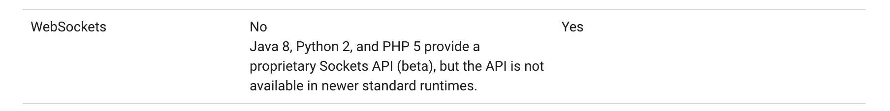
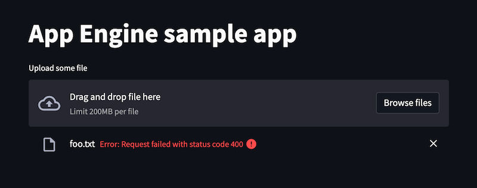
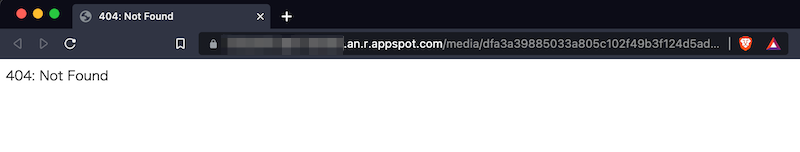

## Things to know
There are some things to know when you deploy Streamlit apps to App Engine.

### The flexible environment is mandatory
You have to choose the flexible environment because it supports WebSockets and the standard environment does not.
Streamlit heavily relies on WebSockets for the communication between the server and the client.


*This is a screenshot of https://cloud.google.com/appengine/docs/the-appengine-environments on 2021/12/12. The left is about the standard env and the right is the flexible env.*

### Custom runtime is not necessary
You **do not have to** use a custom runtime (an original Docker image).
The flexible environment offers an official Python runtime as https://cloud.google.com/appengine/docs/flexible/python/runtime and you can use it.

Still, you can also use a custom runtime. For example, it is a nice option when you want to use a different Python version or when you already have a working Docker image.

NOTE:
As of 2021/12/12, [the document](https://cloud.google.com/appengine/docs/flexible/python/runtime) says the Python version on the built-in Python3 runtime is `3.7.2`, but it is actually `3.6.10` known from `sys.version` at least in the `asia-northeast1` zone (Tokyo).
And Streamlit officially supports only Python>=3.7 while it is technically possible to be installed with Python 3.6, so maybe you should set up a custom runtime with Python>=3.7 following the section below.

### The number of instances should be 1 if `st.file_uploader` or `st.download_button` is used
If your app contains `st.file_uploader` or `st.download_button`, you should set the maximum number of instances to 1. For that configuration, see https://cloud.google.com/appengine/docs/flexible/python/reference/app-yaml#services.

App Engine typically distributes the requests evenly among available instances so the file upload/download requests sometimes reach the instance different from the one where the session exists when there are multiple instances.

Errors as below appear in such cases.


*When an error occurs with file upload: The file upload request reaches a server where the session does not exist and the server returns the 400 error code.*


*When an error occurs with file download: The file download request reaches a server where the session does not exist and the 404 response is returned.*

This problem occurs with the file uploader/downloader components because they use normal stateless HTTP POST/GET requests while other components work on top of WebSocket connections consistent over sessions.

While I know this problem occurs at least with these components, I'm not sure whether there is another component which have this problem. I have not checked all.

NOTE:
App Engine offers the [session affinity](https://cloud.google.com/appengine/docs/flexible/ruby/using-websockets-and-session-affinity#session_affinity) setting, but it does not help in this case because it is only for HTTP long polling like `socket.io` as [documented](https://cloud.google.com/appengine/docs/flexible/ruby/using-websockets-and-session-affinity#session_affinity) though this problem is due to a different reason.

## Recipes
I will show some examples deploying Streamlit apps to App Engine in different situations.

Each of them can be deployed with the command below.
```shell
$ gcloud app deploy
```

All sample resources are available at https://github.com/whitphx/streamlit-appengine-samples .

### Basic setup
This is the simplest one.

* No custom runtime
* No config on the number of instances (scaling)
  * This app is not using file uploader or downloader.

https://github.com/whitphx/streamlit-appengine-samples/tree/main/helloworld

#### File list
```
.
├── app.yaml
├── requirements.txt
└── streamlit-app.py
```

#### `app.yaml`
```yaml
runtime: python
env: flex

runtime_config:
  python_version: 3

entrypoint: streamlit run streamlit-app.py --server.port $PORT

```
* The flexible environment is selected.
* The built-in Python3 runtime is used.
* `entrypoint` is configured to run the Streamlit process with the specified port number via the `$PORT` environment variable.
  * See https://cloud.google.com/appengine/docs/flexible/python/runtime#application_startup

#### `requirements.txt`
```txt
streamlit~=1.2.0

```

#### `streamlit-app.py`
```python
import streamlit as st

st.title("App Engine sample app")

name = st.text_input("Your name?")

st.write(f"Hello, {name or 'world'}!")
```

## File uploader and downloader
This is a sample with a file uploader and a downloader.

### File list
```
.
├── app.yaml
├── requirements.txt
└── streamlit-app.py
```

#### `app.yaml`
```yaml
runtime: python
env: flex

runtime_config:
  python_version: 3

entrypoint: streamlit run streamlit-app.py --server.port $PORT

automatic_scaling:
  max_num_instances: 1

# Or manual scaling as below:
# manual_scaling:
#   instances: 1

```
In addition to the basic set-up, `automatic_scaling.max_num_instances` is set to `1`.
If you want to use the manual scaling, use `manual_scaling.instances` instead.

For these settings, see https://cloud.google.com/appengine/docs/flexible/python/reference/app-yaml#services.

#### `requirements.txt`
```txt
streamlit~=1.2.0

```

#### `streamlit-app.py`
```python
import streamlit as st

st.title("App Engine sample app")

uploaded_file = st.file_uploader("Upload some file")
if uploaded_file:
    st.write(f"{uploaded_file.name} was uploaded.")

    st.download_button(f"Download {uploaded_file.name}", data=uploaded_file, file_name=uploaded_file.name)

```

## Custom runtime
This sample uses a custom runtime with `Dockerfile`.

Ref: https://cloud.google.com/appengine/docs/flexible/custom-runtimes/build

```
.
├── Dockerfile
├── app.yaml
├── requirements.txt
└── streamlit-app.py
```

#### `app.yaml`
```yaml
runtime: custom
env: flex

```

* Set `runtime: custom` to use a custom runtime.
* `entrypoint` is not needed as it is defined in `Dockerfile`.

#### `Dockerfile`

```Dockerfile
FROM gcr.io/google-appengine/python

# Ref:
# * https://github.com/GoogleCloudPlatform/python-runtime/blob/8cdc91a88cd67501ee5190c934c786a7e91e13f1/README.md#kubernetes-engine--other-docker-hosts
# * https://github.com/GoogleCloudPlatform/python-runtime/blob/8cdc91a88cd67501ee5190c934c786a7e91e13f1/scripts/testdata/hello_world_golden/Dockerfile
RUN virtualenv /env -p python3.7

ENV VIRTUAL_ENV /env
ENV PATH /env/bin:$PATH

ADD requirements.txt /app/
RUN pip install -r requirements.txt

ADD . /app
ENTRYPOINT [ "streamlit", "run", "streamlit-app.py", "--server.port", "8080" ]

```
* Use the base image officially provided by Google for App Engine, `gcr.io/google-appengine/python`.
  * App Engine has a health checking mechanism and the official base image is already configured for it.
  * See https://cloud.google.com/appengine/docs/flexible/python/customizing-the-python-runtime
* Specify the Python version at virtualenv creation.
  * Follow [the README.md on `GoogleCloudPlatform/python-runtime`](https://github.com/GoogleCloudPlatform/python-runtime/blob/8cdc91a88cd67501ee5190c934c786a7e91e13f1/README.md#kubernetes-engine--other-docker-hosts)
* [Some `Dockerfile`s of the test data in that repository](https://github.com/GoogleCloudPlatform/python-runtime/blob/8cdc91a88cd67501ee5190c934c786a7e91e13f1/scripts/testdata/hello_world_golden/Dockerfile) can be references
* The main process has to listen to the port 8080 in a custom runtime.
  * See https://cloud.google.com/appengine/docs/flexible/custom-runtimes/build#listening_to_port_8080


#### `requirements.txt`
```txt
streamlit~=1.2.0

```

#### `streamlit-app.py`
```python
import sys

import streamlit as st


st.write(sys.version)

```
