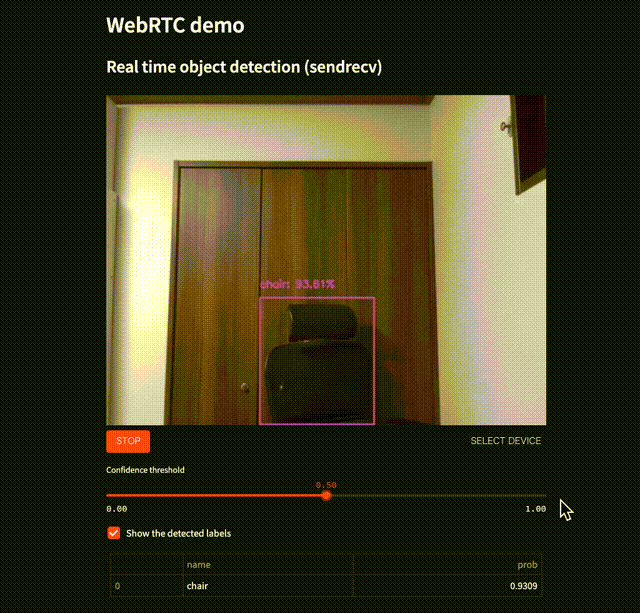
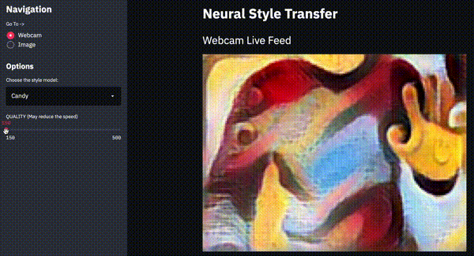
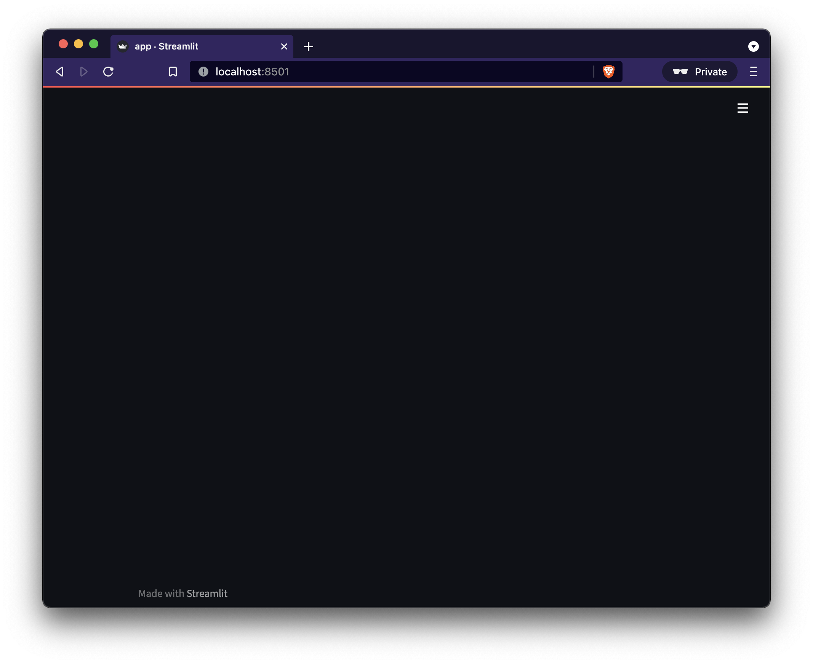
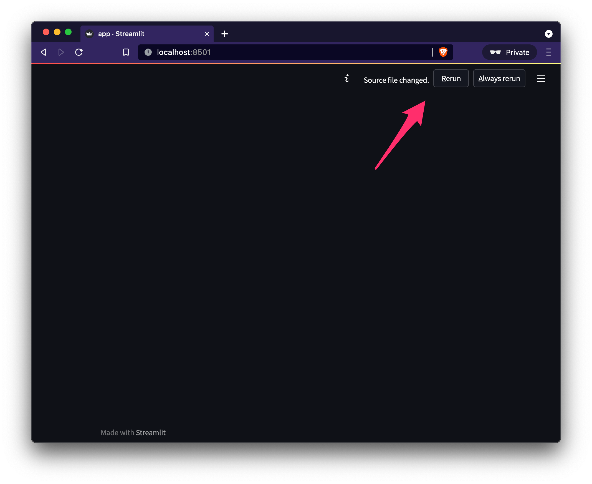
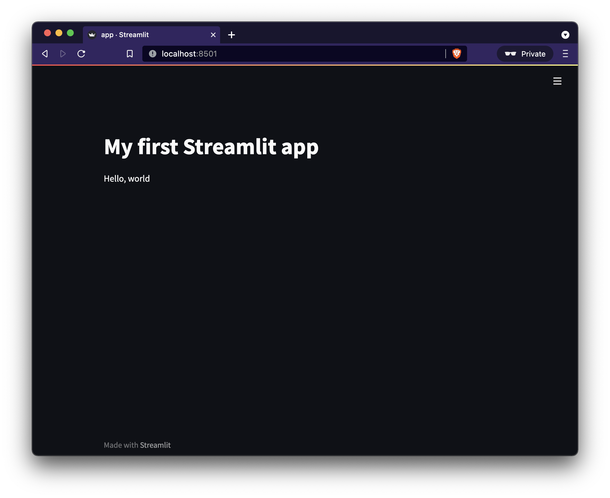
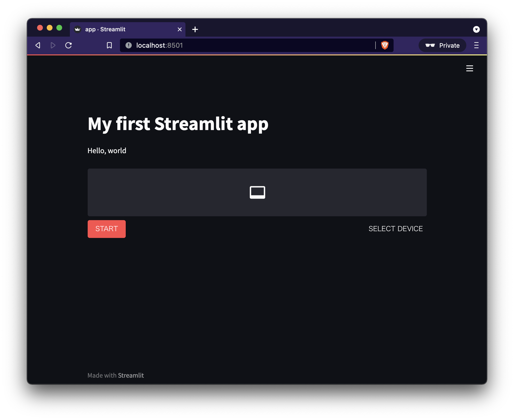
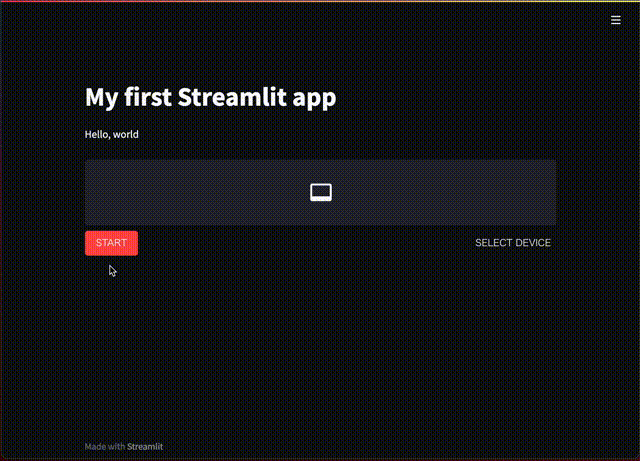
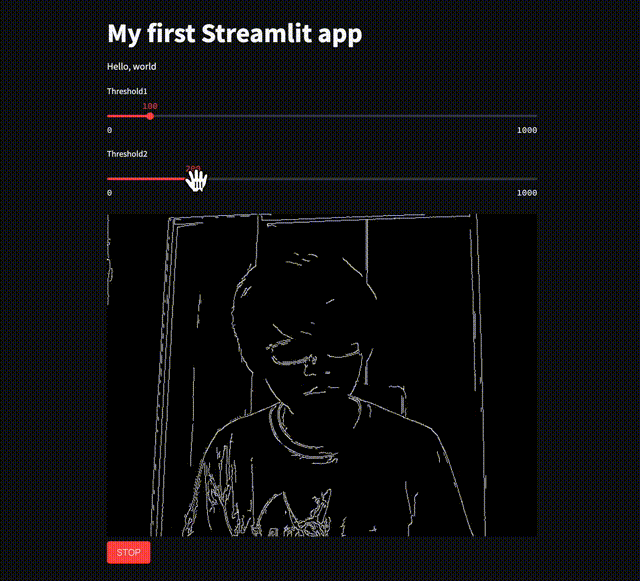

# Overview

In this article, we will see how we can create browser-ready real-time video/audio processing apps with [Streamlit](https://streamlit.io/).

Streamlit is a Python framework with which developers can quickly build web apps without frontend coding. On top of it, developers can make real-time video/audio processing apps that receive video/audio streams from users' media devices, only with ~10 lines of code in the case of the simplest example.

Since such apps are web-based, they can be deployed to the cloud, shared with users easily, and have modern and user-friendly UIs.

This tech stack is useful for creating demos and prototyping ideas of video/audio apps such as human or object detection, style transfer, image filters, speech recognition, video chat apps, and more.

<br>
*A sample web-based object detection app. Users can change the threshold interactively during execution. [Online demo🎈](https://share.streamlit.io/whitphx/streamlit-webrtc-example/main/app.py)*


<br>
*A sample web-based style transfer app. Users can change model type and model parameters interactively during execution. [Online demo🎈](https://share.streamlit.io/whitphx/style-transfer-web-app/main/app.py)*

You can see more examples at [the _examples_ section](#examples).

NOTE:
These sample apps are hosted on the public cloud ([Streamlit Cloud](https://streamlit.io/cloud)), and the video and audio streams are transmitted to and processed at the cloud server. While those data are only processed on memory and not saved to any storage, however, if you are concerned, please do not use them.
As for the following contents in this article, we can execute all of them on our local. In addition, you can try the examples above on your local by following the instructions at [the _examples_ section](#examples).

# The advantages of web-based apps
We have been typically using OpenCV to build real-time demo apps of image or video processing. Some of you (especially developers or researchers in such fields) may have seen the following code or similar many times.

```python
import cv2

cap = cv2.VideoCapture(0)

while True:
    ret, frame = cap.read()

    img = cv2.Canny(frame, 100, 200)  # Some image processing

    cv2.imshow('frame', img)
    if cv2.waitKey(1) & 0xFF == ord('q'):
        break

cap.release()
cv2.destroyAllWindows()
```

Compared to the GUI apps like above using `cv2.VideoCapture` and `cv2.imshow` that run on local environments, web-based apps have some advantages like below.
* Easy to share and run:
  * If we deploy the apps on the cloud, we can share the apps with our users simply by sending the URLs.
  * The users can use the apps only by accessing them through web browsers. It does not require any set-ups or external dependencies.
* Usable on smartphones
  * Because all the users need is web browsers, the users can use the apps on their smartphones. It's convenient if we can show demos on such portable devices.
* User-friendly UIs.
  * Developers can use text inputs, sliders, or other web-based components to accept user inputs or show data. Such web-based UIs are more friendly for users than desktop GUIs in recent days.

# Tutorial
We will create a simple web-based real-time video processing app with ~10 or 20 LoC.
Please try this tutorial in an environment where a webcam and a microphone are available.

You can check the final result of this tutorial in [this repository](https://github.com/whitphx/streamlit-webrtc-article-tutorial-sample). The deployed online demo is [here🎈](https://share.streamlit.io/whitphx/streamlit-webrtc-article-tutorial-sample/main/app.py)

In this tutorial, we will write code in `app.py`. Please create an empty `app.py` at first.
```shell
$ touch app.py
```

## Install necessary packages
Next, we have to install the packages necessary for this tutorial.
```shell
$ pip install -U streamlit streamlit-webrtc opencv-python-headless
```
* `streamlit`: The Streamlit main package.
* `streamlit-webrtc`: A custom component of Streamlit which deals with real-time video and audio streams.
* `opencv-python-headless`: OpenCV. We choose the headless version here because we will construct the UI with Streamlit.

## First contact with Streamlit

NOTE:
Please skip this section if you have experience in Streamlit.

First of all, launch the Streamlit with the command below. Please run the command in the same directory to the `app.py`.
```shell
$ streamlit run app.py
```
After a while, the Streamlit server process will boot up. Then access http://localhost:8501 to see the page like below (or it will automatically open in the browser by default).
The screenshot here is in dark-mode, and if you are using light-mode, it looks different.

At this moment, there is no content on the web page because `app.py` is empty. We will add lines of code in the `app.py` for the Streamlit app.



Open the `app.py` with your editor and write the code below.
```python
import streamlit as st

st.title("My first Streamlit app")
st.write("Hello, world")
```
When you save the file, Streamlit will detect the file change and shows the "Rerun" and "Always rerun" buttons on the top right of the screen.



Click the "Rerun" button. Then the web page is reloaded, and the page content would be like below. The web page content is generated based on the `app.py` code.



If you had clicked the "Always rerun" button, the page would automatically be reloaded every time the file changed.

Note that you have to reload the page like above in the following instructions where you update the `app.py`.

Now we have walked through the basic development flow of Streamlit apps.
You write Python code with Streamlit components like `st.title()` and `st.write()` and pass it to the `streamlit run` command, then Streamlit generates the corresponding frontend contents on the web page.

In the next section, we will see how to develop a real-time video processing app on top of Streamlit.
Apart from that, Streamlit itself covers more use cases such as machine learning, data science, or more general purposes. For such use cases, please see [the official Streamlit tutorial](https://docs.streamlit.io/library/get-started/create-an-app) for example.

## Introduce the real-time video/audio streaming component
Update the `app.py` as below.

```python
import streamlit as st
from streamlit_webrtc import webrtc_streamer

st.title("My first Streamlit app")
st.write("Hello, world")

webrtc_streamer(key="example")
```

We have added a single line with `webrtc_streamer()`.
The web app would be like the screenshot below.


At the first trial, it may take some time to compile the package so that the page keeps showing the "running" message for a while after clicking the "Rerun" button. In such a case, wait for the process to finish.

Click the "START" button to start the video and audio streaming.
You may be asked for permission to access the webcam and microphone at the first trial. Grant permission in that case.


The `webrtc_streamer(key="example")` above is a Streamlit component which deals with video and audio real-time I/O through web browsers.
The `key` argument is a unique ID in the script to identify the component instance. We have set it as `"example"` here, but you can use any string for it.
The component in this example only receives video and audio from the client-side webcam and microphone and outputs the raw streams. It's the most basic version of the component. We are going to enhance its functionality by adding other options in the following sections.

## Development of a real-time video processing application

Update the `app.py` as follows.
```python
import streamlit as st
from streamlit_webrtc import webrtc_streamer
import av
import cv2

st.title("My first Streamlit app")
st.write("Hello, world")


class VideoProcessor:
    def recv(self, frame):
        img = frame.to_ndarray(format="bgr24")

        img = cv2.cvtColor(cv2.Canny(img, 100, 200), cv2.COLOR_GRAY2BGR)

        return av.VideoFrame.from_ndarray(img, format="bgr24")


webrtc_streamer(key="example", video_processor_factory=VideoProcessor)
```

Try it out by clicking the "START" button like the previous section.
With this new example, you can find that an image filter is applied to the video stream.


We have defined a class and its method `VideoProcessor#recv()`, a callback that receives an input frame and returns an output frame. We also put image processing (edge detection in this example) code inside the callback. As a result, we have injected the image processing code into the real-time video app through the callback.

Detailed explanations about the code follow.
* `webrtc_streamer()` can take a class object with `.recv()` method as its `video_processor_factory` argument[^2].
* The `.recv()` receives and returns input and output image frames. These are instances of the [`VideoFrame`](https://pyav.org/docs/develop/api/video.html#av.video.frame.VideoFrame) class from [`PyAV`](https://github.com/PyAV-Org/PyAV).
  * The `PyAV` library is a Python binding of `ffmpeg`, which provides video and audio capabilities. It is installed as a dependency of `streamlit-webrtc`.
* The argument of `.recv()` is an image frame in the input video stream sourced from the webcam. It can be converted into a NumPy array with `frame.to_ndarray()`.
* The returned value from `.recv()` is displayed on the screen. In the sample above, a new `VideoFrame` object to be returned is generated from a NumPy array, with `av.VideoFrame.from_ndarray(img, format="bgr24")`[^3].
* Any code can be put inside the callback. In the example above, we have used an edge detection filter `cv2.Canny(img, 100, 200)` (and a grayscale converter `cv2.cvtColor(img, cv2.COLOR_GRAY2BGR)`) as an example.

[^2]: Precisely, "an object with a callback method named `recv`" can be passed to the `video_processor_factory` argument. It means that a class object can be the argument because, in Python, a class object is a callable returning its instance object.

[^3]: Some experienced readers have noticed that we have not set the timing information of each frame. `streamlit-webrtc` automatically sets such info to each frame when returned from the callback. It is also possible for the developers to set it manually, and `streamlit-webrtc` does nothing in that case.

Now, we have created a browser-ready real-time video processing app!
We used a simple Canny edge detector in this example, and you can replace it with any image processing code in your original app.

If we use object detection or style transfer for that part, the app would be like the screenshots at the beginning of this article[^4].

[^4]: [The source code of the object detection app](https://github.com/whitphx/streamlit-webrtc/blob/d6ce5b51e6c367a2e9488b8a50bfc652fee3b936/app.py#L309-L451) and [the style transfer app](https://github.com/whitphx/style-transfer-web-app/blob/2c835d11010b8d5c9acc8c8d681c9dfd0687b2ac/input.py#L37-L96).

## Receive user inputs
Update the `app.py` as below.

```python
import streamlit as st
from streamlit_webrtc import webrtc_streamer
import av
import cv2

st.title("My first Streamlit app")
st.write("Hello, world")


class VideoProcessor:
    def __init__(self) -> None:
        self.threshold1 = 100
        self.threshold2 = 200

    def recv(self, frame):
        img = frame.to_ndarray(format="bgr24")

        img = cv2.cvtColor(cv2.Canny(img, self.threshold1, self.threshold2), cv2.COLOR_GRAY2BGR)

        return av.VideoFrame.from_ndarray(img, format="bgr24")


ctx = webrtc_streamer(key="example", video_processor_factory=VideoProcessor)
if ctx.video_processor:
    ctx.video_processor.threshold1 = st.slider("Threshold1", min_value=0, max_value=1000, step=1, value=100)
    ctx.video_processor.threshold2 = st.slider("Threshold2", min_value=0, max_value=1000, step=1, value=200)
```

Then click the "START" button.
You will find that there are 2 sliders in this example.
You can modify the parameters of `cv2.Canny()` through the sliders, even during execution in real time.



The explanations of the code follow:
* We added `.threshold1` and `.threshold2` attributes to the `VideoProcessor` class. They are used as parameters of `cv2.Canny()` inside the `.recv()`.
* `webrtc_streamer` returns a context object, so we assign it to the `ctx` variable.
* A class object passed to `webrtc_streamer()` via the `video_processor_factory` argument will be instantiated and set to `ctx.video_processor`.
  * It is not set when the video stream is not active, so we check its existence with the `if` clause.
* So, in this example, the instance of `VideoProcessor` class will be set to `ctx.video_processor`, and we can access its `.threshold1` and `.threshold2` attributes. Then we assign the slider values to these attributes so that the parameters of `cv2.Canny()` can be changed via the sliders.
  * I will explain later why we don't (can't) pass the slider values to `cv2.Canny()` directly.
* The slider UI is created with `st.slider()` in Streamlit apps.
  * `st.slider()` is a built-in Streamlit component. Its official API reference is https://docs.streamlit.io/library/api-reference/widgets/st.slider.

## Execution model of `recv()` and an important notice about it
<!-- One major difference between OpenCV and `streamlit-webrtc` is the callback usage. -->
Unlike OpenCV, `streamlit-webrtc` requires callbacks to process image and audio frames.
The callback `.recv()` is one major difference between OpenCV GUI and `streamlit-webrtc`, and there are a few things you have to be aware of about it.

Please note that `.recv()` is executed in a forked thread different from the main thread where the Streamlit app code runs.
It makes some restrictions as below.
* The `global` keyword does not work as expected inside `.recv()`.
* Streamlit methods such as `st.write()` cannot be used inside `.recv()`.
* Communications between inside and outside `.recv()` must be thread-safe.

In the previous example, we passed values from the global scope to `.recv()` since we cannot use `global` and refer to these values from inside `.recv()`.

# Deploy the app to the cloud
We are going to make the web app available to everyone by deploying it to the cloud.

## Configure WebRTC
To deploy the app to the cloud, we have to add `rtc_configuration` parameter to the `webrtc_streamer()`.

```python
ctx = webrtc_streamer(
    key="example",
    video_processor_factory=VideoProcessor,
    rtc_configuration={  # Add this line
        "iceServers": [{"urls": ["stun:stun.l.google.com:19302"]}]
    }
)
```
This configuration is necessary to establish the media streaming connection when the server is on a remote host.

`streamlit_webrtc` uses WebRTC for its video and audio streaming.
It has to access a "STUN server" in the global network for the remote peers (precisely, peers over the NATs) to establish WebRTC connections.
As we don't see the details about STUN servers in this article, please google it if interested with keywords such as STUN, TURN, or NAT traversal.

We configured the code to use a free STUN server provided by Google in the example above. You can also use any other available STUN servers[^5].

[^5]: I once received a report that it took so long to make a connection with the library. The reason was that the reporter used Google's STUN server from the Chinese network. It was solved by changing the server. https://github.com/whitphx/streamlit-webrtc/issues/283#issuecomment-889753789

The value of the `rtc_configuration` argument will be passed to the [`RTCPeerConnection`](https://developer.mozilla.org/en-US/docs/Web/API/RTCPeerConnection/RTCPeerConnection) constructor on the frontend.

## HTTPS
We have to serve web apps on remote hosts via HTTPS to use webcams or microphones.

Not only the `webrtc_streamer()` component we used here but also any frontend apps that access the client-side webcams or microphones use [`MediaDevices.getUserMedia()`](https://developer.mozilla.org/ja/docs/Web/API/MediaDevices/getUserMedia) API. This API does not work in an "insecure context."

The [document](https://developer.mozilla.org/en-US/docs/Web/API/MediaDevices/getUserMedia#privacy_and_security) says
> A secure context is, in short, a page loaded using HTTPS or the `file:///` URL scheme, or a page loaded from `localhost`.
> [MediaDevices.getUserMedia() - Privacy and security](https://developer.mozilla.org/en-US/docs/Web/API/MediaDevices/getUserMedia#privacy_and_security)

As a result, we need HTTPS to serve web apps on remote hosts which access the client-side webcams or microphones.

## Streamlit Cloud
I recommend [Streamlit Cloud](https://streamlit.io/cloud) for Streamlit app hosting.
You can deploy the apps from GitHub repositories with a few clicks, and it automatically serves the apps via HTTPS.
And Streamlit Cloud seems to provide better runtime than Heroku free-tier, while Streamlit Cloud provides a large deployment capacity for free.

Please refer to [the official document](https://docs.streamlit.io/streamlit-cloud) for its usage.

I actually deployed the app we have seen in this article on Streamlit Cloud: https://share.streamlit.io/whitphx/streamlit-webrtc-article-tutorial-sample/main/app.py .

Its GitHub repository is https://github.com/whitphx/streamlit-webrtc-article-tutorial-sample .

Note that `requirements.txt` has been added to install the necessary dependencies (`streamlit-webrtc` and `opencv-python-headless`) in the Streamlit Cloud environment: https://github.com/whitphx/streamlit-webrtc-article-tutorial-sample/blob/main/requirements.txt

# Notice
As written above, the video and audio streams sourced from the client devices are transmitted to and processed at the server.

So, this library is not scalable and depends on network connectivity. You may think of it mainly for prototyping or demo purpose.

You also have to consider hosting the apps in local networks if there are concerns about transmitting media to the remote cloud server.

# Examples
This section is a copy of the sample list at https://github.com/whitphx/streamlit-webrtc.

## Showcase including following examples and more
[⚡️Repository](https://github.com/whitphx/streamlit-webrtc-example), [🎈Online demo](https://share.streamlit.io/whitphx/streamlit-webrtc-example/main/app.py)
* Object detection
* OpenCV filter
* Uni-directional video streaming
* Audio processing

You can try out this sample app using the following commands on your local env.
```
$ pip install streamlit-webrtc opencv-python-headless matplotlib pydub
$ streamlit run https://raw.githubusercontent.com/whitphx/streamlit-webrtc-example/main/app.py
```

## Real-time Speech-to-Text
[⚡️Repository](https://github.com/whitphx/streamlit-stt-app), [🎈Online demo](https://share.streamlit.io/whitphx/streamlit-stt-app/main/app_deepspeech.py)

It converts your voice into text in real time.
This app is self-contained; it does not depend on any external API.

## Real-time video style transfer
[⚡️Repository](https://github.com/whitphx/style-transfer-web-app), [🎈Online demo](https://share.streamlit.io/whitphx/style-transfer-web-app/main/app.py)

It applies a wide variety of style transfer filters to real-time video streams.

## Video chat
[⚡️Repository](https://github.com/whitphx/streamlit-video-chat-example)
(Online demo not available)

You can create video chat apps with ~100 lines of Python code.

## Tokyo 2020 Pictogram
[⚡️Repository](https://github.com/whitphx/Tokyo2020-Pictogram-using-MediaPipe): [🎈Online demo](https://share.streamlit.io/whitphx/tokyo2020-pictogram-using-mediapipe/streamlit-app)

[MediaPipe](https://google.github.io/mediapipe/) is used for pose estimation.

# What about audio?
You can deal with audio streams in a similar way as video. If you define a class with `.recv()` method and pass it to the `audio_processor_factory` argument, the callback will be executed with audio frames.
In the case of audio, the input argument and the returned value of the callback are instances of [the `AudioFrame` class](https://pyav.org/docs/develop/api/audio.html#module-av.audio.frame).

Please see the source code of [a sample app changing the audio gain](https://github.com/whitphx/streamlit-webrtc/blob/d6ce5b51e6c367a2e9488b8a50bfc652fee3b936/app.py#L233-L273) or the Speech-to-Text app in the examples above.
