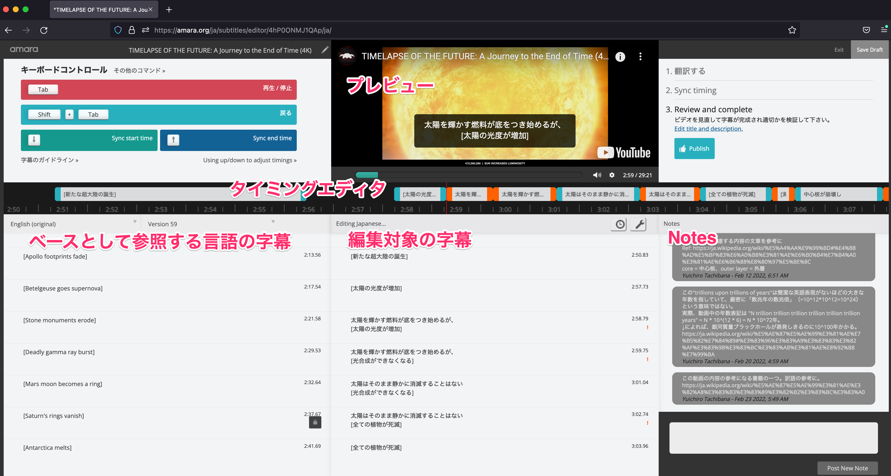

[以前のポスト](../20220205-fix-youtube-subtitle-mistranslation/)で、人気宇宙動画"TIMELAPSE OF THE FUTURE"の日本語字幕を１カ所修正したと書いた。

[TIMELAPSE OF THE FUTURE: A Journey to the End of Time (4K)](https://www.youtube.com/watch?v=uD4izuDMUQA)

上記ポストの時点では、作者に直接メールで問い合わせて字幕ファイルをもらい、修正したファイルを送り返してYouTube動画に反映してもらった。

この動画の他の言語の字幕は[Amara](https://amara.org/)というコミュニティベースの字幕翻訳プラットフォームで編集されているが、日本語はそこにホストされておらず、上記のようなアナログなやりとりになってしまった。

しかしその後、日本語字幕に気になる箇所を大量に見つけてしまい、腰を据えて修正作業をしようと思い立った。
そのためにAmaraに日本語プロジェクトを立ち上げ、そこで作業を進めることにした。

プロジェクトページはこちら。
[日本語 - TIMELAPSE OF THE FUTURE: A Journey to the End of Time (4K) | Amara](https://amara.org/ja/videos/4hP0ONMJ1QAp/ja/2468256/)

Amaraで作業した方が良いと思った理由・Amaraの利点は以下の通り。
* 編集履歴が残り、最新版がどれかもわかる。SSoT (Single Source of Truth)が一つに定まり、混乱が生じない。
* 誰でも編集に参加できる。自分だけでなく、間違いを見つけた人が気軽に修正できる方が良い。
  * Amaraがないと作者とメールで字幕ファイルをやりとりする必要があるわけで、これはハードルが高い
* Note機能があり、字幕本体とは別に任意の文章を書いておける。これで、訳を考える際に参照した資料へのリンクやその時の考えなどを残しておける。
* ブラウザベースの字幕エディタが使える

作者に了解を取った上で、既存の字幕ファイルをベースにプロジェクトを開始した。

Amaraの字幕エディタは以下のようになっている。
既に完成している別言語の字幕（今回は英語）をベースにして、それに一つずつ対訳をつけるような形で新しい言語の字幕（今回は日本語）が作れる。

今回の日本語字幕プロジェクトは、以下の流れで開始し、今に至っている。
1. 既存の字幕ファイルをアップロード
    * 最初に作者から頂いた状態のもの。私が編集を加えていないバージョン。既存の成果物はそのまま履歴に残しておく。
        * このバージョンへのリスペクトもあるし、実利的にも、その後の編集で何かトラブルがあっても最悪ここまでは戻すことができる点を確保するのは大事。
    * [Revision 4](https://amara.org/ja/videos/4hP0ONMJ1QAp/ja/2468256/13199988/)として履歴に残った
        * 最初は勝手がわからず色々やっていたらrevision 1~3は変な感じになってしまった。
2. 全字幕を消す。
3. エディタの日本語字幕編集エリアを、参照元（英語）と同じ数の字幕（内容は空白）で埋め、全字幕のタイミング情報をコピーする。
4. 日本語字幕を、英語の対訳として、既存の日本語字幕からのコピペで埋めていく。
    * これはまだ準備段階。翻訳そのものの修正はしない。
    * 既存の日本語字幕と参照先の英語字幕では、タイミング情報が全く一致していなかった。また、文の区切り方も違っていた。これをあえて一度無理やり一致させた。
    * これでこの後、対訳ベースで修正作業がしやすくなる。
    * タイミング情報の一致を優先して無理やりコピペしているので、この段階では、連続する字幕に同じ文字列が入ったりしているが、それは許容する。これらは後で最適化する。
    * [Revision 5](https://amara.org/ja/videos/4hP0ONMJ1QAp/ja/2468256/13200102/)
5. 編集していく
    * がんばる
6. ある程度完成したら、微調整する。
    * 元々英語字幕のタイミングに合わせていたが、日本語字幕としてちょうどいい文の区切りなどに合わせていく
        * 適当に切ったり、無駄な分割をマージしたり。
7. 納得いくまで微調整の繰り返し。
    * 永遠に終わらない
    * 一旦完成した気になったら、１週間くらい寝かせて見直すと、また直したくなる

本ポストの時点で、開始からだいたい１ヶ月経って、おおよそ完成したと思う。

ちなみに、ある程度完成したら作者に知らせようと思っていたら、いつの間にかAmaraで編集した字幕がYouTubeに即時反映されるようになっていた。ありがたい。

https://twitter.com/whitphx_ja/status/1500503256111656960

---

ある程度完成したとはいえ、それはつまり私一人からひねり出せるアウトプットが枯渇気味ということでもあるし、見返すたびに修正箇所が出てくる気がする。

もし気になる点やもっと良い訳を思いついた方がいたら、１カ所からでも大歓迎なので、ぜひ編集に参加していただけるとありがたいです。

最後にもう一度翻訳ページへのリンクを：
[日本語 - TIMELAPSE OF THE FUTURE: A Journey to the End of Time (4K) | Amara](https://amara.org/ja/videos/4hP0ONMJ1QAp/ja/2468256/)
