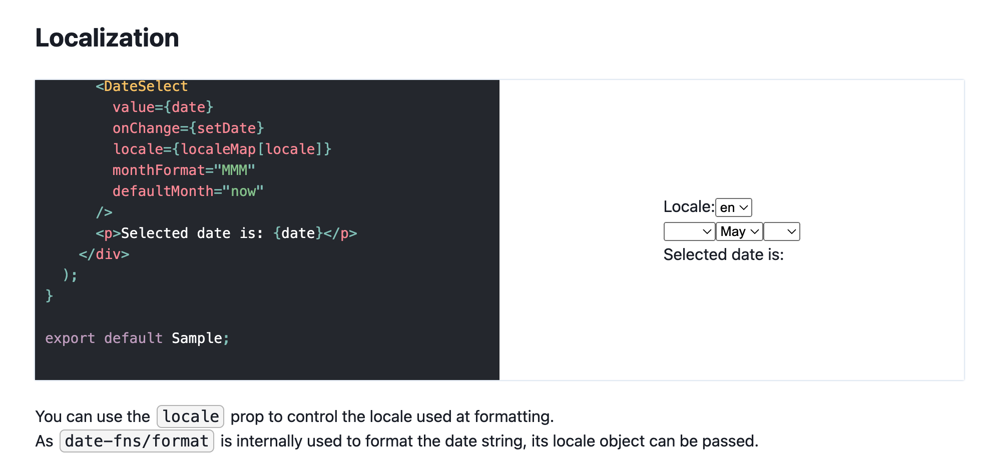
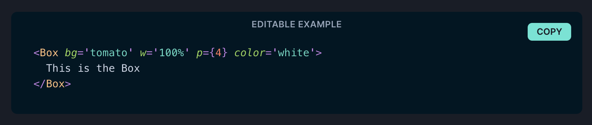

I recently [created a React component library](../20220511-react-ymd-date-select) and wanted to publish a demo page for it that shows what the library can do with sample code.

The actual demo page is like the following. There are **a code editor with preset sample code and a rendering result of the React component side by side**. Both are embedded in the demo page along with other elements.
[](https://whitphx.github.io/react-ymd-date-select/)
[The demo page of `react-ymd-date-select`](https://whitphx.github.io/react-ymd-date-select/)

# TL;DR

To do that,
**[React Runner](https://github.com/nihgwu/react-runner) was the best in my situation**, compared to the following alternatives.

- [React Live](https://github.com/FormidableLabs/react-live)
  - This does not support `import` statements in the sample code.
- [Sandpack](https://sandpack.codesandbox.io/) ([`@codesandbox/sandpack-react`](https://www.npmjs.com/package/@codesandbox/sandpack-react))
  - This does not support nested paths such as `import Something from "package/subpath"`
    - https://github.com/codesandbox/codesandbox-client/issues/6499
- Embedding sample code at build time with bundler's setting as such as raw-loader for Webpack.

  - We can't create editable live samples only with this.
  - This requires 2 imports per example as below, but I did not like that due to its redundancy.

    ```tsx
    import SampleComponent from "./components/Sample"
    import SampleComponentCode from "./components/Sample?raw"

    ...

    <LivePreview
      component={SampleComponent}
      code={SampleComponentCode}
    />
    ```

# Requirements/conditions

- I wanted to show the sample code and the rendered React component side by side.
  - It's better if users can edit the code and the result changes dynamically.
- Those samples should also be used as E2E test suites, so each sample code should be self-contained and executable without implicit dependencies.
  - Each component file should import necessary packages and export a component.
- The demo site is built with React.
  - The actual code base is https://github.com/whitphx/react-ymd-date-select/tree/main/website
- The target library is for React, so sample code is also written with React.
- They are written in TypeScript.

# Comparison

## React Runner

[React Runner](https://github.com/nihgwu/react-runner) satisfied all my needs.

One drawback of this is that it requires all the libraries that might be imported in the samples to be bundled into the web page. While it's natural and technically inevitable, it leads to bigger bundle size.
[Sandpack](#sandpack) below may not have this problem.

## React Live

[React Live](https://github.com/FormidableLabs/react-live)

A popular library for this purpose. For example, [Chakra UI's doc](https://chakra-ui.com/) is using this for its editable examples like the screenshot below.
[](https://chakra-ui.com/docs/components/layout/box)

The author of [React Runner](https://github.com/nihgwu/react-runner) [wrote](https://github.com/nihgwu/react-runner#react-live-runner) that it was inspired by React Live.
From its design, React Runner looks like a superset of React Live.

I did not use React Live because I wanted to show complete and self-contained sample code including `import` statements, but React Live did not support it.

## Sandpack

A component library of the famous online code editor, [CodeSandbox](https://codesandbox.io/).

As my project was using React, its variant for React, [`@codesandbox/sandpack-react`](https://www.npmjs.com/package/@codesandbox/sandpack-react) was the candidate.

This was also a nice library, but I could not choose it because it does not support imports from nested paths such as `import Something from "package/subpath"`.

My library was built both for ESM and CommonJS and the CommonJS version allowed such nested imports, so I wanted to show that.

If this limitation is not a problem for you, Sandpack may be the best for you.

## Embedding sample code at build time

Some bundlers allow to import the file contents as string instead of normal modules.
There are [`raw-loader`](https://v4.webpack.js.org/loaders/raw-loader/) for Webpack and [`?raw` query](https://vitejs.dev/guide/features.html#static-assets) for Vite.

This was also a nice solution as I could have each sample code as a separate `*.jsx` or `*.tsx` file and that was comfortable to write the code.

```tsx
// Sample.tsx

function SampleComponent() {
  return <div>This is a sample</div>
}

export default SampleComponent
```

```tsx
// DemoSite.tsx

import SampleComponent from "./components/Sample"
import SampleComponentCode from "./components/Sample?raw"

...

export default function() {
  ...
  return (
    ...
    <LivePreview
      component={SampleComponent}
      code={SampleComponentCode}
    />
    ...
  )
}
```

However, it requires 2 imports per 1 sample code and it was redundant.
Also, it does not provide live-editing experience.
