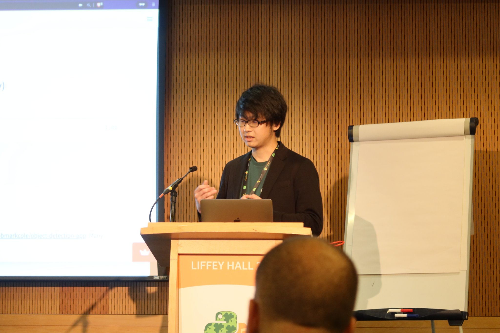

I presented a talk at EuroPython 2022 in Dublin.

The talk title was **"real-time browser-ready computer vision apps with Streamlit."**
It was on 14th July, and its description is linked below.
https://ep2022.europython.eu/session/real-time-browser-ready-computer-vision-apps-with-streamlit

Its contents were mainly based on the Medium post I wrote with a similar title, ["Developing Web-Based Real-Time Video/Audio Processing Apps Quickly with Streamlit"](https://towardsdatascience.com/developing-web-based-real-time-video-audio-processing-apps-quickly-with-streamlit-7c7bcd0bc5a8),
but the talk contained live-demo, live-coding, and more storytelling introduction.

The live-stream archive that contains my talk has already published as linked below (this link is pointing to my talk time), while the edited version will be open later:

https://www.youtube.com/watch?v=uVD6B8WLMTo&t=16118s

You can find my voice was so high-pitch and my hands moved randomly because I was so nervous, especially at the beginning... ironically, I could speck in such a high speed due to many practices I did 😂

([@takanory](https://twitter.com/takanory) took this picture of me. Thanks.)

Regardless of that, I could successfully present all the contents as I planned and some people said it was informative nice talk which made me so glad.

It was nice that with this talk, I could (a bit) promote my OSS project that I'm dedicated to and have positive feedback.
