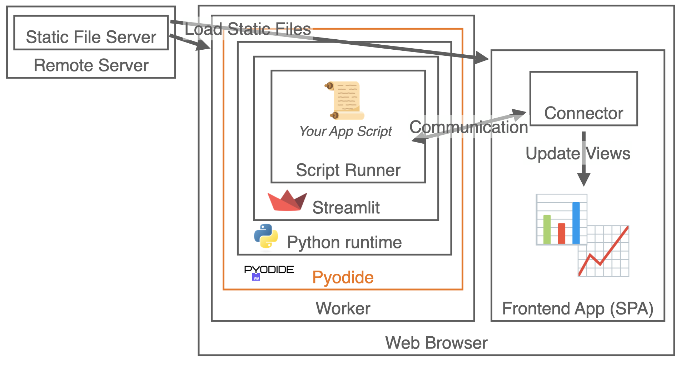
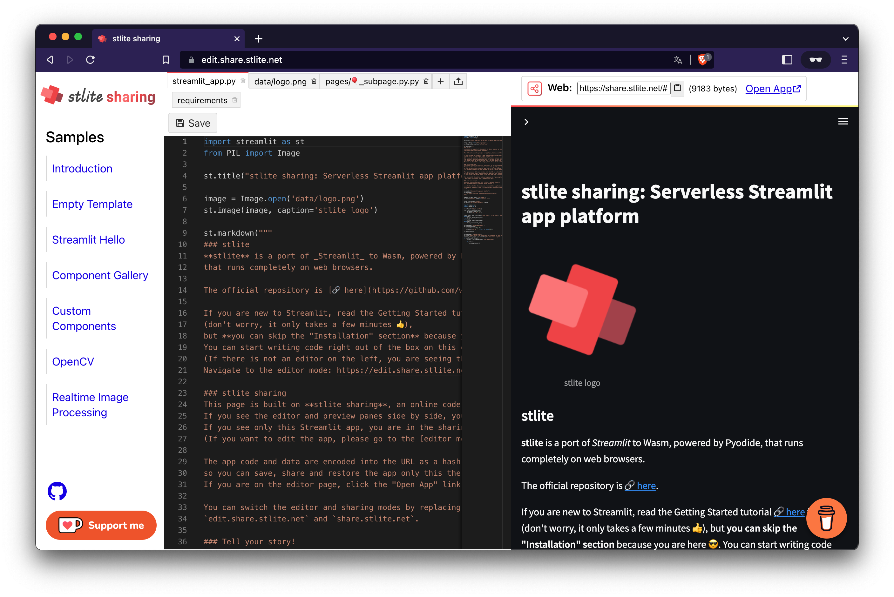

## TL;DR
* I created a WebAssembly (Wasm) port of Streamlit, "stlite".
* You can try it out and share your apps on "[stlite sharing](https://edit.share.stlite.net/)", the online code editor + app sharing platform for stlite.
* The Wasm-based runtime provides many benefits such as
  * Offline capability
  * Data privacy
  * Scalability
  * Multi-platform availability
* In addition to [stlite sharing](https://edit.share.stlite.net/), you can also host your Streamlit/stlite apps on your web site or create offline desktop applications.

## Streamlit: a great Python web app framework

[](https://streamlit.io/)

[Streamlit](https://streamlit.io/) is a web app framework with which we can create interactive web apps only with Python coding. It is especially famous and popular for data apps development as it well supports many data widgets cooperating the DS/ML Python ecosystem, while it also covers a wide range of general purpose web development.

<video controls="" loop=""><source src="https://s3-us-west-2.amazonaws.com/assets.streamlit.io/videos/hero-video.mp4"></video>

Streamlit launches a web server and also serves a frontend app that is a single page application (SPA) whose contents are dynamically constructed according to the Python script written by the app developer. Then the frontend app continuously communicates with the web server and triggers the Python code executions on the server upon some events to get some results that dynamically update the frontend view.
Due to this unique server-client architecture, we can construct interactive web apps only by writing the logics in the server-side Python code.


## stlite: a client-side Streamlit powered by Pyodide

There had been an epoch-making invent in the Python world - [Pyodide](https://pyodide.org/). It is a CPython runtime compiled for WebAssembly (Wasm) that runs on web browsers (and NodeJS).

[](https://pyodide.org/)

So I customized Streamlit to run on Pyodide runtime and released it as "[stlite](https://github.com/whitphx/stlite)"!

[](https://github.com/whitphx/stlite)

On _stlite_, the entry point is a JavaScript file that mounts the Streamlit frontend SPA into the HTML page, loads the Pyodide environment, and launches the Streamlit Python server on the Pyodide environment **on the web browser**.

With this architecture, thanks to Pyodide, the Python runtime no longer exists on the server side since it runs on the web browser.
The web server is only for serving the static files such as HTML, JS, and CSS.



## Benefits

As it runs completely on the browsers, the serverless Streamlit, _stlite_ has some benefits that the original Streamlit does not have.

(This section and the next are highly inspired by [the blog post about Shinylive](https://shiny.rstudio.com/py/docs/shinylive.html).)

### Offline capability
As even the Streamlit "server" runs on the browser, all the components resides on the client side, so once all the resources are loaded from the web server, the app can run in offline.

<!-- If you serve the stlite web app as a [Progressive Web App (PWA)](https://web.dev/progressive-web-apps/), it becomes an installable stand-alone application.

_stlite_ also supports bundling desktop applications (e.g. `.exe` files) too, as we will see in the following section. -->

### Data privacy
Since the entire app runs on your browser, even when you do "upload" some files from the file uploader on the page, these files are NEVER sent to any remote servers and only processed within your machine.

This feature is sometimes beneficial especially in the applications of data science, machine learning, or statistics where Streamlit is widely used for, as these often have strict privacy rules.

### Scalability
The main workload such as machine learning computation written in Python moves from the server to each browser, so the system becomes scalable. It can be seen as one type of distributed computing.

### Multi-platform: web, desktop, mobile
As it runs on web browsers, it can also be an installable app ([PWA](https://web.dev/progressive-web-apps/)), and can be bundled into a desktop app (Electron) or a mobile app (Capacitor).

### Online editing experience
I developed the online editor & real-time preview service for Streamlit apps based on _stlite_ - **stlite sharing** that we will see below soon.
Precisely, this is not purely because of WebAssembly, but the Wasm-based architecture made it easier to create such a service which could have not existed before.

## Disadvantages
On the other hand, _stlite_ and Pyodide has some disadvantages as a tradeoff.

### Some packages are not available
Some C extension packages such as TensorFlow cannot be installed because C extensions must be built for the Pyodide runtime specifically.
For more details, read the Pyodide articles such as [this](https://pyodide.org/en/stable/usage/faq.html#micropip-can-t-find-a-pure-python-wheel)

### Large initial payload
A large amount of resources will be downloaded when the user opens the app because Pyodide loads the whole Python runtime and the standard libraries, and _slite_ also downloads the necessary wheel files including the `streamlit` package.

### Network restriction
For the security reasons, accessing remote resources from the _stlite_ applications are restricted by the browser, e.g. CORS.

### The source code and data are open
Note that all the source code and data are sent to the client side, so they are visible by the users. You cannot set any secrets on the source code.

## Online code editor + app sharing platform: stlite sharing

[](https://edit.share.stlite.net/)

[**stlite sharing**](https://edit.share.stlite.net/) is an online code editor + app sharing platform for _stlite_. It is the easiest and fastest way to try out _stlite_.

The following screenshot is the online editor & app preview mode of **stlite sharing**. You can try it out at https://edit.share.stlite.net/ .



When you create/edit/delete the files on the left pane, those changes are applied to the virtual file system on top of which _stlite_ runs, then the Streamlit server detects the file changes and recommends you to hot-reload the application, as shown in the screenshot below.
(The file change detection and hot-reloading is a part of the Streamlit core features. If you are not familiar with it, read [the official document](https://docs.streamlit.io/library/get-started/main-concepts#development-flow).)

The file changes are saved to the file system when the "Save" button is clicked.
You can also add or delete the files on the file tabs.


### Sharable URLs

The sharable URL of the app is displayed at top right. There is also the "Open App" link next to it, through which you can open the URL.


By navigating to the URL or clicking the link, the app opens in the sharing mode as below, where only the app opens and there are not the editor, the sharing link, and any other widgets.


Its URL is `https://share.stlite.net/` with a long hash like `#!ChBz...`.

The host `https://share.stlite.net/` is for the app sharing mode of **stlite sharing**, while the editor mode we have seen above is at `https://edit.share.stlite.net/`.

In the long hash part of the URL like `#!ChBz...`,
all the source code and data edited on the editor are encoded and embedded, so you can share the app only by copying this URL.

Another good point of this approach is, since all the code and data are embedded into the URL hash, these are never uploaded and saved to the remote server.

The encoded URL hash is also loadable on the editor mode, so if you open the editor mode URL, https://**edit**.share.stlite.net/ with the hash, the app data will be restored on the editor.

Note that some SNS and URL shortening services cut off the long URLs, so you should take care of it when sharing the URL on these platforms. For the details, read [this part of the Shinylive article](https://shiny.rstudio.com/py/docs/shinylive.html#sharing-shinylive-applications).

This URL mechanism is inspired by [Shinylive](https://shiny.rstudio.com/py/docs/shinylive.html).

### Adding files

By clicking the "+" button at the file tabs area, you can create a new file.

You can also upload files from your local env (the files are never "uploaded" to any remote servers. They are sent to the virtual file system on your browser.) Though this uploader, **you can also add binary files**.


### Files in directories and Multipage apps support

You can edit the file name on the tab, and importantly, by inserting the file path delimiter, `/`, you can create files in directories.


With this feature, **stlite sharing** supports the Streamlit's **Multipage apps**.
In short, by creating a Python file in the `pages/` directory (`pages/*.py`), you can add a new page on the app.
For details, read the [official document about Multipage apps](https://docs.streamlit.io/library/get-started/multipage-apps)

### Installing packages

When you need to install some packages, use the special "requirements" tab.

The package names written in the editor on this tab will be passed to [`micropip.install()`](https://pyodide.org/en/stable/usage/api/micropip-api.html#micropip.install) (with _stlite_ on the Pyodide runtime, [`micropip`](https://pyodide.org/en/stable/usage/api/micropip-api.html) is used as a package manager) when clicking the "Save" button.
You have to write one package per one line.

This is a special tab in that the file content is not saved into the file system. It is used only for specifying the package names passed to `micropip.install()`.


Please note again that some C extension packages cannot be installed as stated above. The following screenshot is the sample of such a case, where installing a C extension failed.


### Samples
You can find some samples on the side menu, so check out these! I hope some inspire you.

For example, the "Streamlit Hello" demo runs the official demo run by `streamlit hello` on _stlite_.


With a recent release of Pyodide [0.21](https://blog.pyodide.org/posts/0.21-release/), many C-extensions became available on it including OpenCV.
**stlite sharing** includes samples using OpenCV and scikit-image with real-time video streaming. Even these samples run on web browsers and nothing are sent to any remote servers!


https://twitter.com/whitphx/status/1583352801195065346

## Host your Streamlit app on your web site

_stlite_ also supports self-hosting the apps.

All you have to do is write and host a single HTML file.

It would be something like below, where you can embed the Python source code into the JS code as string literals.

```html
<!DOCTYPE html>
<html>
  <head>
    <meta charset="UTF-8" />
    <meta http-equiv="X-UA-Compatible" content="IE=edge" />
    <meta
      name="viewport"
      content="width=device-width, initial-scale=1, shrink-to-fit=no"
    />
    <title>stlite app</title>
    <link
      rel="stylesheet"
      href="https://cdn.jsdelivr.net/npm/@stlite/mountable@0.14.0/build/stlite.css"
    />
  </head>
  <body>
    <div id="root"></div>
    <script src="https://cdn.jsdelivr.net/npm/@stlite/mountable@0.14.0/build/stlite.js"></script>
    <script>
      stlite.mount(
        `
import streamlit as st

name = st.text_input('Your name')
st.write("Hello,", name or "world")
`,
        document.getElementById("root")
      );
    </script>
  </body>
</html>
```

If you need to install some packages, specify the entrypoint file name, and/or use multiple files, use the more flexible API as below.

```js
stlite.mount(
  {
    requirements: ["matplotlib"], // Packages to install
    entrypoint: "streamlit_app.py", // The target file of the `streamlit run` command
    files: {
      "streamlit_app.py": `
import streamlit as st
import matplotlib.pyplot as plt
import numpy as np

size = st.slider("Sample size", 100, 1000)

arr = np.random.normal(1, 1, size=size)
fig, ax = plt.subplots()
ax.hist(arr, bins=20)

st.pyplot(fig)
`,
    },
  },
  document.getElementById("root")
);
```

After writing the HTML file, host it wherever you like, such as GitHub Pages.
In your local env, you can test it with `python -m http.server 8000`.

This YouTube video may guide you to set it up on GitHub Pages (although the HTML API is out-dated.)

https://youtu.be/VQdktxgbmmg

**Please read the [README](https://github.com/whitphx/stlite#use-stlite-on-your-web-page) for the details**.

## Bundle your Streamlit app as a desktop app

The _stlite_ apps run on web browsers, so it is also possible to bundle them into desktop apps with Electron.


https://twitter.com/DataChaz/status/1577750208364134421

To create your own desktop app with _stlite_,
**follow this instruction! ->** https://github.com/whitphx/stlite/tree/main/packages/desktop-cli#readme

There is a sample app repository and its distributable files too.
* [A sample app repository](https://github.com/whitphx/stlite-desktop-example)
* [Distributable files](https://github.com/whitphx/stlite-desktop-example/releases/tag/v0.2.0) (the macOS app file is not signed, so the security alert may be shown)

## Tell us your story!

When you create some apps with _stlite_, please share it!

If it's on **stlite sharing**, all you need to do is copy and paste the URL from it 👍

These are good places to share your apps, samples, or case studies!

* [**stlite** GitHub Discussions](https://github.com/whitphx/stlite/discussions/categories/show-and-tell)
* [Streamlit community forum](https://discuss.streamlit.io/)
