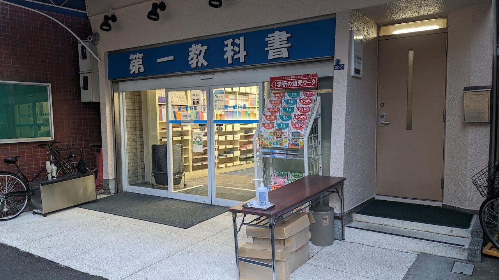
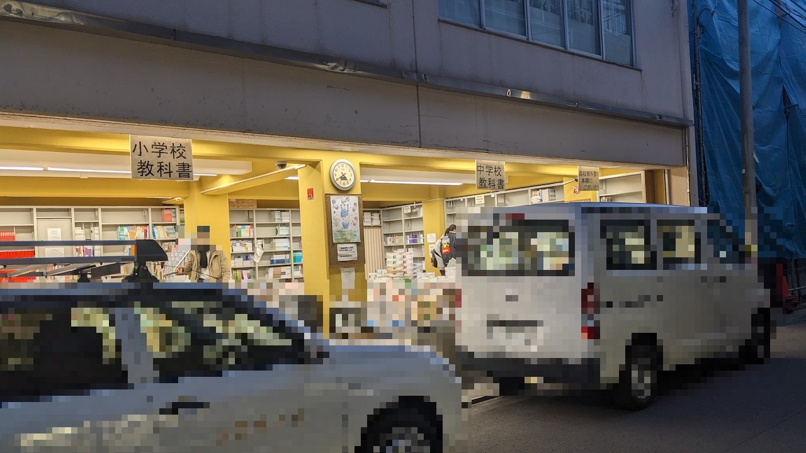
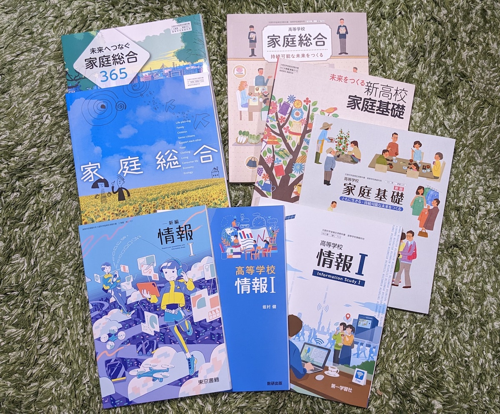
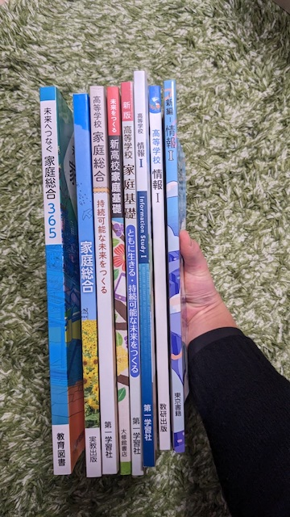
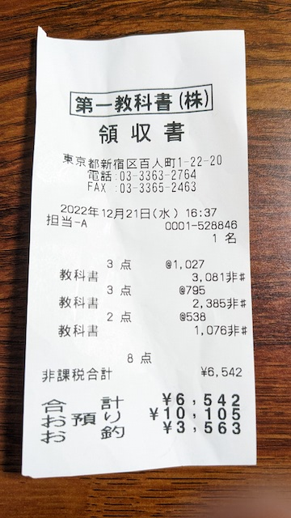

## 教科書を読みたくなった

高校を卒業して10年以上経つが、今の教科書を読みたくなったので買いに行った。
今回の目的は家庭科と情報の教科書。

## 家庭科
例えば、一人暮らしを始める・初めて雇用される・初めて確定申告をするなどのタイミングで、関連する法律や社会制度を調べたり、もしくは後から調べておけばよかったと思ったりしたことがある。
その都度「こういう社会生活に必要な知識は学校で教えておいて欲しいな」と思い、実際ツイートしたこともあるような気がする。

そんな折、Twitterで「今の家庭科ではそういった知識も教えている。教えられていないと言うと世代がバレるぜ〜（意訳）」みたいなツイートが流れてきた。
今検索したら当該ツイートは消されてしまったようだが、それを見たときは割と感心して、学習指導要領をチェックしてみた。実際、「これをちゃんと身につけたら相当社会生活の役に立つだろうな」と思う内容が詰め込まれていた。

https://twitter.com/whitphx_ja/status/1598341733431283712

とはいえ、かなりの分量なので、これを家庭科のコマ数の中でどう生徒に伝えるように教科書は作られているのだろうか、という次の疑問が湧いた。
また、本当にこの通りの学びが得られるなら、今から読んでも（むしろ今だからこそ）人生の役に立つのでは、と思い、次は実際に教科書を買って読んでみることにした。

## 情報
後述するとおり、教科書を買いに行くのは少し面倒が伴う。
それで家庭科の教科書だけ買って帰るのも何かもったいない気がしたので、情報の教科書も買うことにした。

単純に自分の専門分野だから気になるというのもあるし、周囲には学生向けの情報教育に携わっている人も多いのでSNSなんかで関連する話は流れてくる。
情報が教育課程に組み込まれたときは、割と自分の周りは大騒ぎだった。
今でも断片的な情報が流れてきて、それに対して感想を持ったりもするが、実際に教科書を読まずに何かをいうのは良くないだろう、ということで情報の教科書も買うことにした。

## 買いに行く

教科書は一般の書店では買えず、特別な販売店に行く必要がある。
以下のサイトの情報を参考にした。

[中学・高校の教科書を購入できる2つの買い方 | Qikeru：学びを楽しくわかりやすく](https://media.qikeru.me/school-textbook/)

私が行ったのも、このサイト同様、大久保の第一教科書という店。

会計があるメインの建物。こちらには教科書ガイドが置かれている。

道を挟んで反対にある倉庫。教科書の陳列はこちら。

買ってきた教科書。
出版社による違いや、家庭基礎・家庭総合による違いも気になったので複数購入。

ちなみに久しぶりに持ってみるとかなり重い。カラー印刷で一般の本より密度の高い紙を使ってあるから？

全部で6500円くらい。支払いは現金のみ。
教科書は本体に値段が書いていないので、会計するまで値段が分からない。
気になる人は販売店のサイトなどに価格表があるので事前に調べていくと良い。

これから読む。
感想などはまた後日。
