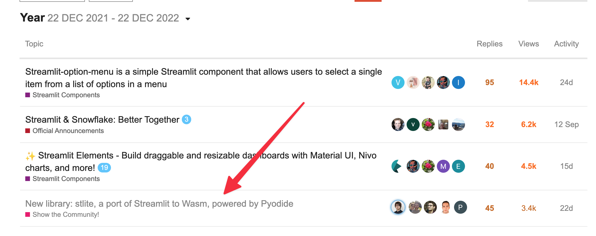

## OSS活動
以前から開発を続けているVSCode用Emacsキーバインド拡張[Awesome Emacs Keymap](https://marketplace.visualstudio.com/items?itemName=tuttieee.emacs-mcx)と、[Streamlit](https://streamlit.io/)周辺の貢献がメイン。

### Awesome Emacs Keymap

2019/01から開発をしているVSCodeのEmacsキーバインド拡張。

VSCodeは公式が各種キーバインド拡張をVimもAtomもSublimeもBracketsも[提供している](https://code.visualstudio.com/docs/getstarted/keybindings#_keymap-extensions)のにEmacsだけ公式拡張が無く、自分で作るしかなかった。

詳しい話は以前[VSCodeのキーバインド拡張を作ったので、その勘所を紹介 - Qiita](https://qiita.com/whitphx/items/af8baa19fc4280ac1c0a)に書いたりした。

https://marketplace.visualstudio.com/items?itemName=tuttieee.emacs-mcx

### streamlit-webrtc
2021年から続けている、Streamlitで映像・音声をリアルタイムに扱うための拡張。

今年はコアAPIの大幅刷新を行った[v0.40.0](https://github.com/whitphx/streamlit-webrtc/blob/main/CHANGELOG.md#0400---2022-06-07)をリリースして、より使いやすくなったはず。
[昨年末に書いたチュートリアル](../20211231-streamlit-webrtc-video-app-tutorial/)（[日本語版](https://zenn.dev/whitphx/articles/streamlit-realtime-cv-app)）もこれに合わせて更新した。

また、このライブラリについて[EuroPython 2022](https://ep2022.europython.eu/session/real-time-browser-ready-computer-vision-apps-with-streamlit)と[PyCon APAC 2022](https://tw.pycon.org/2022/en-us/conference/talk/249)で発表してきた。
初めてのプログラミング系のカンファレンス登壇だったが楽しかった。

EuroPythonについてはgihyo.jpのレポート記事内に[コラムを書かせてもらった](https://gihyo.jp/article/2022/09/europython2022-02#gh8ayWxRNC)。

https://youtu.be/D4F6GKaoLns

https://youtu.be/ruSN7t2eor4

### stlite
今年に新しく始めたプロジェクト。
Streamlitをプラウザだけで動かせるようにする。
この前[紹介記事](../20221104-streamlit-wasm-stlite/)も書いた。

CPythonのWasmビルド、[Pyodide](https://pyodide.org/)が出てから、それに乗っかってここ数年で各種PythonフレームワークのWasm化プロジェクトがたくさん出てきた。
私がstliteを始めた時に認識していたのは[JupyterLite](https://github.com/jupyterlite)[^1]や[PyScript](https://pyscript.net/)。stliteをやってるうちに知ったのが[Shinylive](https://shiny.rstudio.com/py/docs/shinylive.html)、[Panel](https://panel.holoviz.org/)、[WebDash](https://github.com/ibdafna/webdash)。私のstliteもこれらの仲間と言えると思う。

実は去年くらいからアイディアはあって、実装の調査などもしていた。Streamlitのフォーラムでも、コミュニティメンバーからStreamlitのWasm化の要望はあって、議論はしていた（→[
Feature idea, Pyodide JupyterLite like Streamlit](https://discuss.streamlit.io/t/feature-idea-pyodide-jupyterlite-like-streamlit/19919/8)）。
しかし色々忙しくて手をつけていなかったところで、[PyCon US 2022でPyScriptが発表され](https://www.youtube.com/watch?v=qKfkCY7cmBQ&list=PL2Uw4_HvXqvYeXy8ab7iRHjA-9HiYhRQl&ab_channel=PyConUS)たのを見て、乗り遅れるまいと急いで着手したのが今年の5月。

まだまだ世間的には無名のプロジェクトだが、[Streamlitのフォーラムに投稿した](https://discuss.streamlit.io/t/new-library-stlite-a-port-of-streamlit-to-wasm-powered-by-pyodide/25556)ところ、一応コミュニティ内ではそれなりに好意的な反応を頂けて、当該スレッドは過去1年で4位の注目度？ということになっている。フォーラムでStreamlitのコアチームのメンバーから反応があったのも良かった。

また、コミュニティメンバーのうちYouTubeで活動している人たちが紹介ビデオを作ってくれたのも嬉しかった。

https://youtu.be/7Qja9ZAWcfw

https://youtu.be/VQdktxgbmmg

https://youtu.be/xW80fWFuE58?t=802

また、企業からスポンサーを受けることになった。詳しくは次の章で後述。

## 報酬について
### 個人からの寄付
以前から[GitHub Sponsors](https://github.com/sponsors/whitphx)と[Buy Me A Coffee](https://www.buymeacoffee.com/whitphx)にアカウントがあり、多くの方から寄付をいただいていた（参考: [OSS個人開発のモチベーションを高める方法〜金銭的な収益を得る（寄付をもらう）〜](https://qiita.com/whitphx/items/f37216ab2392ab359f11)）。

今年は今更ながらBuy Me A Coffeeと排他ではないなと思い直し[Ko-fi](https://ko-fi.com/whitphx)も開設した。実際、Ko-fiから寄付していただける方もいて、寄付の動線はたくさんある方が良いなと思った。

今年も、たくさんの方からサポートを頂いた年だった。皆様ありがとうございます。
私は割と飽きやすい性格で、ひとつのプロジェクトを3年もやれば飽きてしまいがちなのだが、Awesome Emacs Keymapはもうすぐ開発開始から4年経とうとしていてもまだ続けられている。正直自分が使う分には十分な機能を実装し終わっているので、feature requestとbug reportへの対応がメインなのだが、今でも定期的にモチベを上げて取り組めているのはご支援とその応援コメントのおかげだと思う。

### 企業からの寄付
前述の通り、[stlite](https://github.com/whitphx/stlite)に対して営利企業がスポンサーをしてくれることになった。これはOSSを開発していて初めてのことで、自分のOSS貢献にある種の商業的価値が認められたようで嬉しかった。

1社目は[Databutton](https://www.databutton.io/)というノルウェーのスタートアップ。データアプリ向けのライブラリをクラウドの実行環境込みで提供している会社だが、UIにStreamlitを使っていて、私のstliteに期待してくれているとのこと。
2社目は[Hal9](https://hal9.com/)。こちらはアメリカのスタートアップで、また違った趣のデータアプリ向けのフレームワークを開発している。

OSSの収益化には以前から関心があり、ついこの前も[2022年に OSS 活動によって得た報酬を公開 (sosukesuzuki.dev)](https://sosukesuzuki.dev/advent/2022/14/)を見てすごいなーと思ったところ。
Streamlitは商業的な観点から見ると、営利企業が開発していて、それなりにお金をかけてコミュニティを作り、ビジネスニーズを捉えようとしているOSS、という特徴があると思う。自分がstliteで企業からお金を貰えているのは、間接的にはそのようなOSSのエコシステムに乗れているからと言えるかもしれない。
上記記事のように、広く開発者に使われているOSSに携わってOpen Collectiveなんかを経由して報酬をもらうのが正攻法で憧れるし、私のはある種のコバンザメ戦法なのだけど、これも一つの方法なのかもしれない。

### 考察
個人から頂いているサポートは寄付プラットフォームの特性上、対プロジェクトではなく対個人なので、各支援者がどのプロジェクトを特に応援して下さっているのかは厳密には分からない（もし私個人を応援してくれているのだとしたらこれほどありがたいことはない）が、
寄付の際のメッセージなどから推測するに、[Awesome Emacs Keymap](https://marketplace.visualstudio.com/items?itemName=tuttieee.emacs-mcx)への応援が多いように思える。
キーバインドのように個人の日常作業の生産性に直結するようなソフトウェア、特にEmacsキーバインドのようなコアなユーザの多いソフトウェアは、特定の層に刺さって支援をいただきやすいのかもしれない。

一方でstliteは人生で初めて企業から、それも複数スポンサーをしていただけた。こちらは前述の通り、商業化されたOSSのエコシステムに乗ったプロジェクトであるというのは無関係ではないと思う。

ちなみに2022/12/22現在のstar数は以下の通り。
* streamlit-webrtc ([whitphx/streamlit-webrtc](https://github.com/whitphx/streamlit-webrtc)): 642
* stlite ([whitphx/stlite](https://github.com/whitphx/stlite)): 319
* Awesome Emacs Keymap ([whitphx/vscode-emacs-mcx](https://github.com/whitphx/vscode-emacs-mcx)): 263

こうしてみると、starの多さと支援のいただきやすさは単純に相関していないのが面白い。たとえば寄付メッセージで一番多く名前を見かけるAwesome Emacs Keymapは、star数で見るとたったの263である。
上記のようにプロジェクトの性格ごとに刺さる層が違うし、刺さった時に感じてもらえる価値の深さも違うんだと思う。

[^1]:これに関しては、前身のIodideがPyodideになってJupyterLiteまで続いているので、逆にPyodideを産んだのがJupyterという見方もできそう
