[先日、高校の家庭科の教科書を買った。](../20221221-bought-school-texts/)
その記事にも書いたが、自分が高校卒業後、一人暮らしを始めたりお金を稼いだりといったタイミングで都度調べて学び、学校で教えておいてくれよと思ったような事柄が、実は今は高校の家庭科で教えられているらしいと伝え聞いたからだ。それらについて実際にいくつか見てみる。

ところで、上記記事を書いた後、もう一度教科書販売店に行って以下の２冊を買い足した。
立ち読み時にいいなと思った記述が、一度目に買って帰った教科書をパラパラ見ていたら含まれていないことに気づいたので。

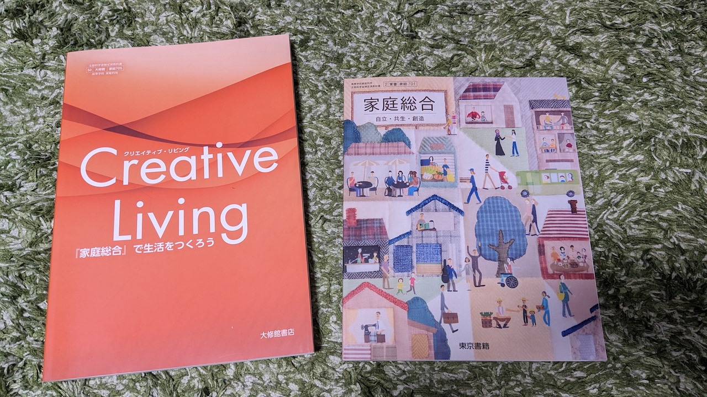

結局、家庭総合の教科書は全出版社分を揃えてしまった（たぶん）。

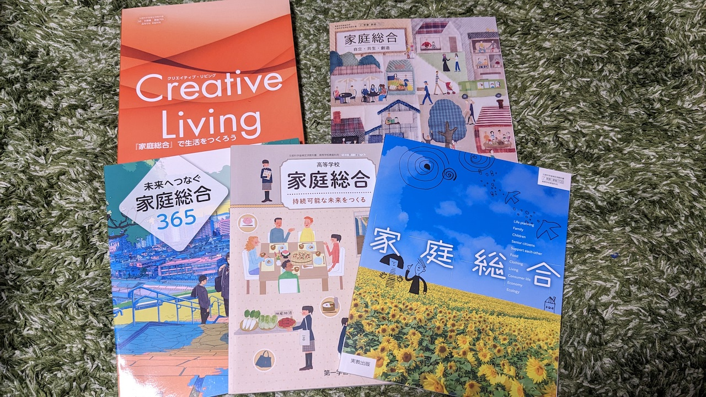

## 資産運用・パーソナルファイナンスについて
初めてまとまったお金を稼いだとき、これをどうにかうまく使えないかという発想になった。色々調べてどこかのブログでインデックス投資のことを知り、そのブログでおすすめされた通り、[ウォール街のランダムウォーカー](https://www.amazon.co.jp/dp/453235823X)を読んで[^1][^2]、実際に投資を始めた。

[^1]: 当時は11版だったが、今は日本語版は12版が最新ぽい。もちろんそっちも買った。
[^2]: その後インデックス投資に関しては[敗者のゲーム](https://www.amazon.co.jp/dp/4532356288)と[投資の大原則](https://www.amazon.co.jp/dp/4532357853)を読んだ。今から人におすすめするなら投資の大原則。ウォール街のランダムウォーカーと敗者のゲームの両著者の共著で、短くまとまっていて読みやすい。また他の投資戦略に関する本もある程度読んだが、本題ではないのでここでは省略。

それが2016年ごろだったと記憶している。今でこそ金融教育は広く話題に上がるが、当時は各人が勝手に興味を持って、勝手に本で勉強する感じだったと思う。
それからNISAや積立NISAが始まり、老後2000万問題なんかもあって、資産運用についての知識がより一般に求められるような空気が醸成されたと感じている。
実際に学校で教えているのだろうか。教科書を見てみよう。

ところで、上述の通り私の手元には５冊（家庭基礎も含めれば７冊）の教科書があるが、全てを網羅して記載するのは大変なので一部だけを載せる。

この分野に関して一番情報量が多いのは大修館書店の[Creative Living『家庭総合』で生活をつくろう](https://www.taishukan.co.jp/kateika/product/?type=textbook&id=57)だと感じた。

また以降の章でも、基本的に大修館書店を参照していく。

個人的には高校の教科書に金融商品のリスク・リターンの関係の図が載っているだけで割と感動ものだった[^3]。ちなみに他社の教科書にはこれはない。

[^3]: なぜリスクとリターンが比例するのかについては、現代ポートフォリオ理論とかを調べてみてください

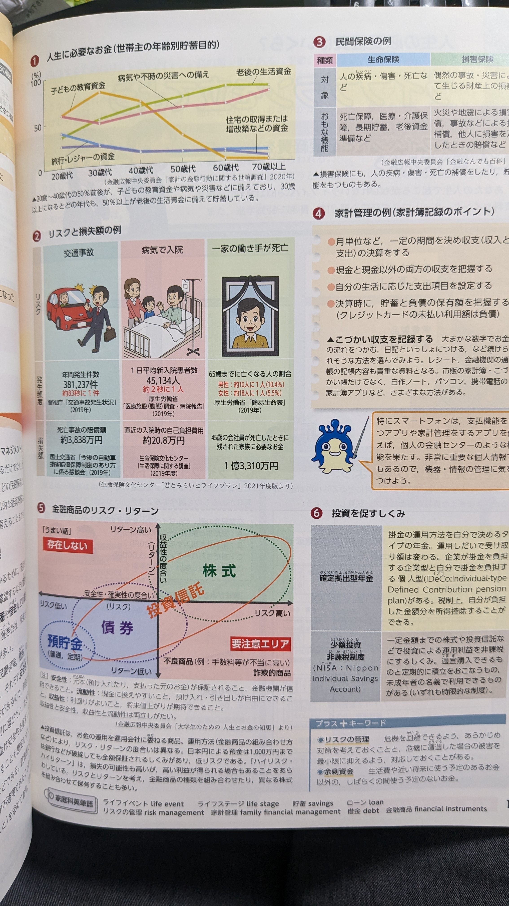

上記の図を含め、資産運用に関する記述は見開き１ページだけだったが、家庭科という教科の守備範囲の広さを考えればこの１テーマに使える分量はこんなもんかという気もする。
また当然ながら具体的な運用戦略に触れる記述はなかった。
リスクを考慮して適切な金融商品を選ぶことが大事であると教科書に書かれているのは、金融リテラシーを教育しようという気持ちを感じてポジティブだ。

ちなみに、このくらいの記述は他社の教科書にもある。例えば第一学習社の教科書には以下のようにまとまっている。

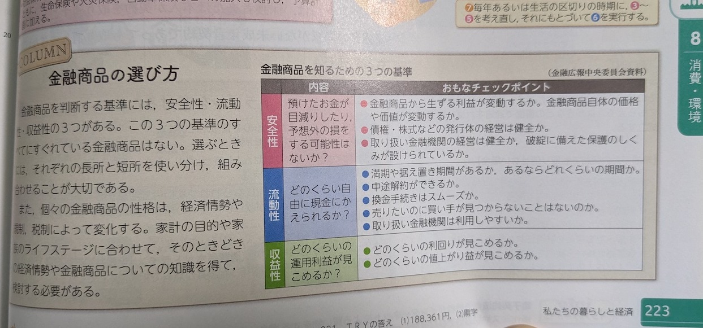

また、教育図書は以下のようなコラムを用意しており、日本は海外に比べて投資意欲が低いみたいな内容を載せている[^4]。
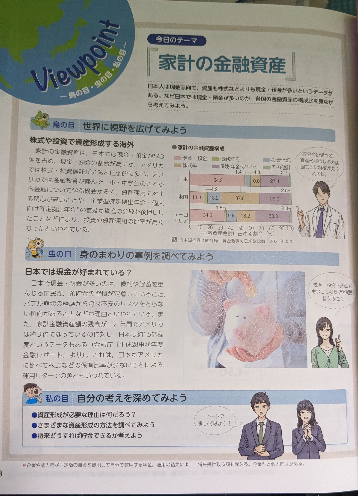

[^4]: こういう記事、数年前に週刊ダイヤモンドとかでよく見たな

## 金を稼ぐことと、納税や社会制度について
学生時代は仕送りで生活費を賄いつつ、学部くらいまでは遊ぶための金をバイトで稼いで、どこからか聞こえてくる「年103万を超えて稼ぐな」というアドバイスに従っていた。
その後[IPA未踏](https://www.ipa.go.jp/jinzai/mitou/portal_index.html)に採択されたときに、個人事業主になった。未踏の支援金はIPAから個人への委託事業に対する対価として支払われるので、個人事業主になって事業所得にするといいよというアドバイスがどこからか聞こえてくる。また当時の支援金は230万円で、103万を超える。さらに同時期に、プログラミングの仕事で103万を超えてまとまった受注があったりしたこともあり、確定申告というものに向き合うことになった。

初めての確定申告では、記入欄が何十もある表を含む、大量の記入用紙を見て頭がフリーズしたのを覚えている。書き方マニュアルを見ても、何が分からないかが分からない（「所得」とは何か、みたいな知識が前提で書いてあったと思う）。確定申告SaaSもわけがわからない[^5]。どうしていいか分からずとりあえず簿記３級を勉強したら確定申告ガイドが読めるようになりなんとかなった[^6][^7]。

[^5]: 簡単入力を謳うfreeeは、自分のケースではどう入力していいかわからなかった。MF確定申告が良さそうだったが、仕訳の入力がわからず、簿記の勉強につながる。
[^6]: 実際に日商簿記３級の参考書で勉強した。勉強だけだともったいないので結局日商簿記３級は取った。試験会場は高校生に囲まれて浮くかなと思ったら割とそんなことはなくて安心した思い出。
[^7]: 振り返ってみれば、確定申告には簿記３級の参考書の前半だけで事足りたと思う。

そんなことがあり、こういう知識って、さわりだけでも学校で教えるわけにはいかないのかな、でも大多数が確定申告するわけじゃないから難しいのかな、などと思っていた。

今回やっと家庭科の教科書で学び直す機会を得たわけだが、
結局、確定申告や納税に関する記述は見つけられなかった（索引で「確定申告」「税」「納税」などを引いてみた）。
一応「社会保障」に関する説明は以下にあったが、経済的な説明ではない。

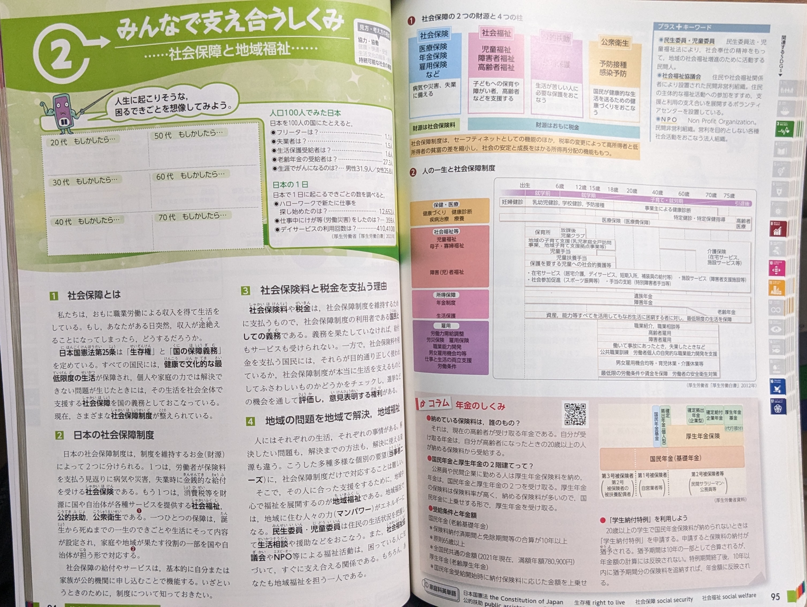

ちなみに教育図書や第一学習社の教科書には、より関連が近そうな知識として以下のような表が載っていた。
上述したような実際に手続きを行うときの役に立つものではないが、社会の仕組みを概観するような手前の知識としては知っておくと良いものではある。

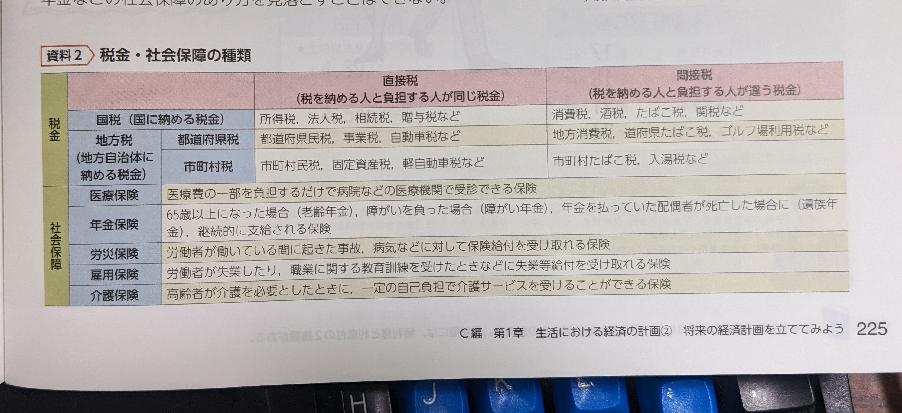
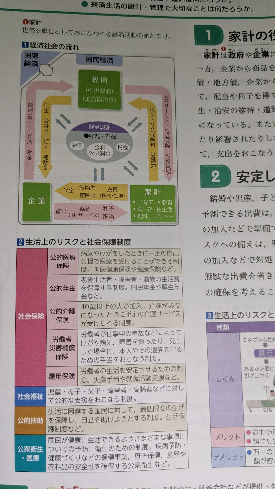

上述の通り学生時代に個人事業主になり、その後は企業に雇用されるのだが、企業で働いているときも個人事業主としての収入はあったので、確定申告はしていた。
今でこそ副業ブームで情報はたくさんあるだろうが、当時は給与所得と事業所得の両方がある場合の確定申告書の書き方の解説がとても少なかった。
それに、どうやら自分の給料のうちいくらかは勝手に会社が国に社会保険料として払っているらしい。これは確定申告書にどう書けばいいんだ？みたいな疑問が無限に湧いてきて、会社勤め1年目の確定申告は2度目の地獄だった記憶がある。

この辺りも、「所得」「収入」「給与」「天引きが何をしているか」みたいな基礎的な知識がしっかりあれば、演繹的に導けたのだろうか。それらの知識は学校で教えてくれないのだろうか。

索引で「収入」を引くと以下のページがヒットした。家計を含む経済の仕組みについての解説で、税法上の云々ではなかった。
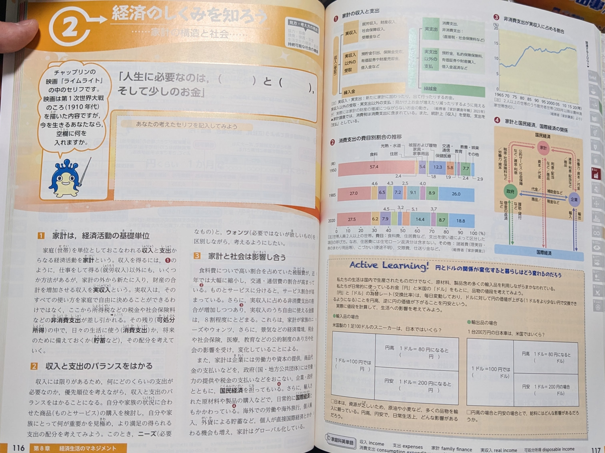

また、給与明細や源泉徴収票にも触れてあったが、詳しい記載はなく役に立たなそうである。
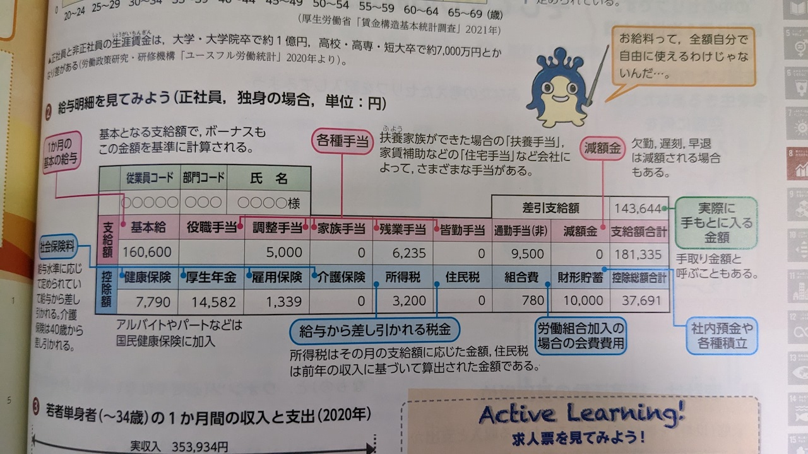
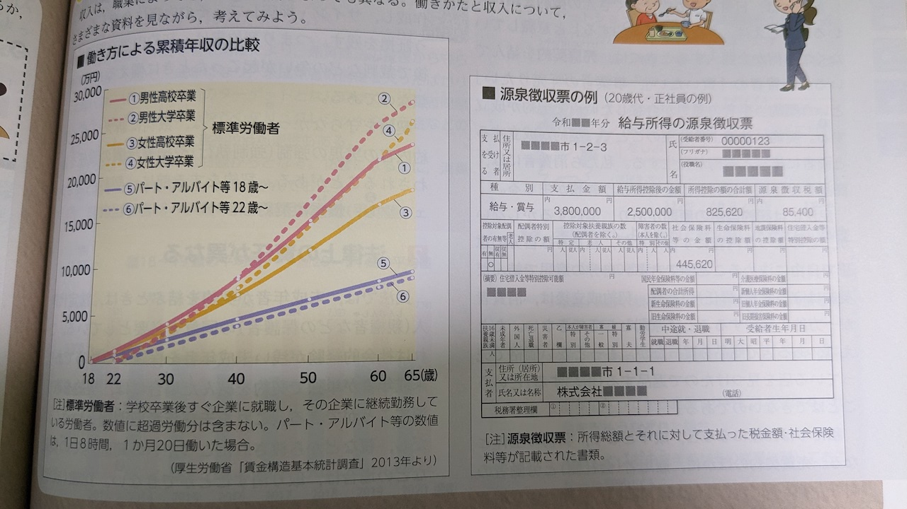

金を稼ぐことについては家計の文脈でのみ触れており、納税に関する記述は一切なく、この分野に関しては期待外れであった。

ちなみに、「給与明細を見てみよう」的なコーナーは全ての教科書にあった。例えば以下は東京書籍。

## 年金や保険について
学生の頃は親から「あんたはうちの扶養に入ってるからこの保険証ね」「今はあんたの年金は納めてるけど、社会に出たら自分で納めるんだよ」とか言われていた。
いざ扶養から外れて（「扶養から外れる」も最初はよく分からなかったけど）調べてみると、「国民年金」「厚生年金」「国民健康保険」みたいな用語が見つかる。親との会話で使っていた語彙と微妙に違って、どれがなんなのかよく分からなかった。

例えば索引で「年金」を引くと、以下のページが当たるが、これは高齢期の生活に関する章であって、年金を納める話ではない。
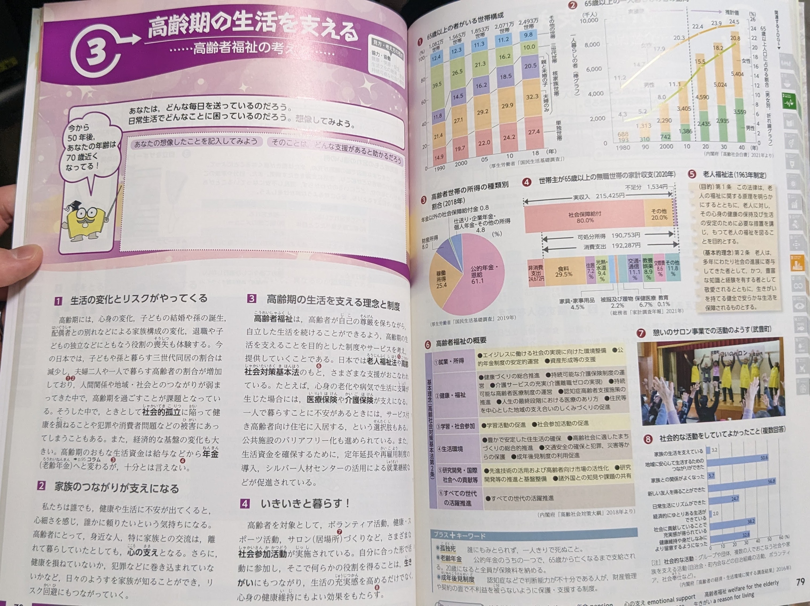

一方、第一学習社の教科書には、経済に関する章で以下の記述がある（これは索引から「年金」で引けなかったが）。
とはいえ、申し訳程度に図を載せているだけで詳細な言及があるわけではない。
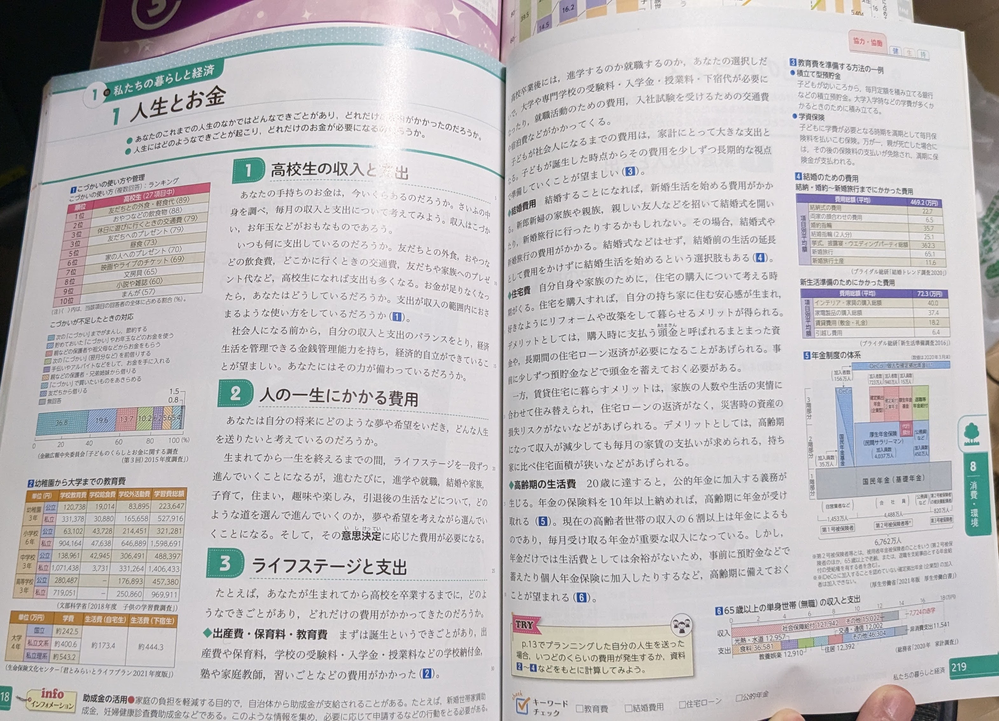
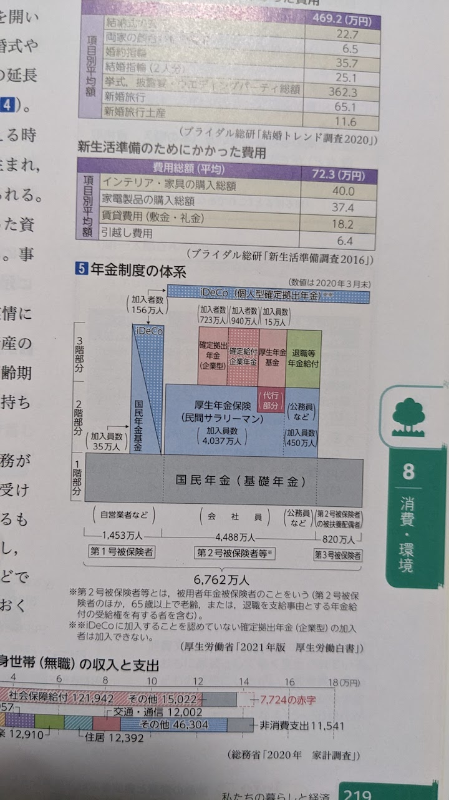

結局、これも当時抱いていた疑問に家庭科が答えてくれるかというと否であろう。

## 労働にまつわる法制度、社会保障について
会社勤め時代の初期は、わりと大学の研究室気分が抜けないチームにいて、自分自身もその雰囲気は嫌いではなく、変な深夜労働・休日出勤をそこそこしていた[^8]。
ただなぜかそれらをちゃんと申請して深夜・休日割増分をちゃんと貰い給与明細で確認し、平日に振替休日を取得するくらいの知恵はあった（会社からもその辺はちゃんとやれと言われていた）。

一方で、後から振り返ると、学生時代のアルバイトでは、厳密に労働基準法に照らせば違法なんじゃないかというものもいくつかあったし（例えば「タイムカードは１分刻みで打刻しないと違法」）、「アルバイトでも（労働時間、日数によっては）有給休暇を取れる」みたいな、法律と正当な権利を主張して自分の利益を確保するための知識みたいなものって、学校で教えておいてほしいなぁと思った記憶がある。

[^8]: その会社の名誉のために付言すると、それらは全く推奨、強制されたものではなく、割と楽しんでやっていたところもある。一方で、ビジネスの立ち上げフェーズだったという環境要因も確かにある。

索引から「労働」から始まる語句を引いてみる。
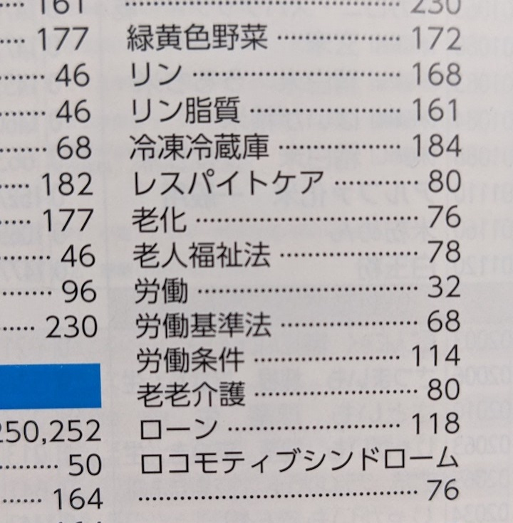
以下が各ページの内容。P114が、「雇用先によって労働条件が変わるのでいいところを選ぼう」という内容で、比較的求めている内容に近そうだが、ドンピシャではない。
意外なのが、P68の「労働基準法」は子育て支援の文脈で登場していること。
* P32の「労働」: 
* P68の「労働基準法」: 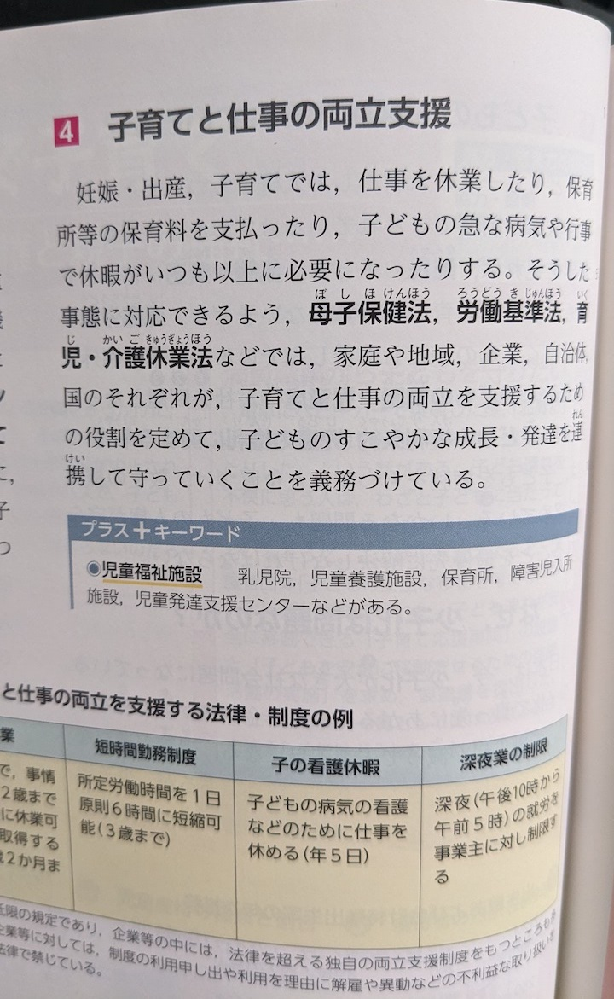
* P114の「労働条件」: 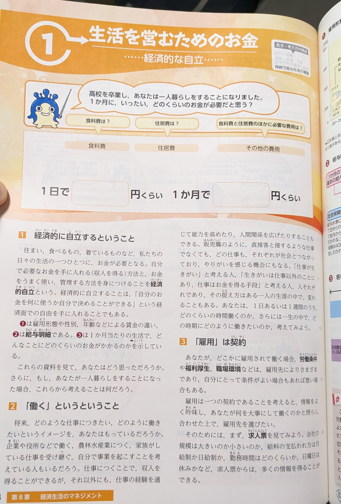

これも、求めているものそのものは載っていなかった。

## そのほかの分野について

家庭科の守備範囲は以下のように幅広い（これは[Creative Living『家庭総合』で生活をつくろう（大修館書店）](https://www.taishukan.co.jp/kateika/product/?type=textbook&id=57)の構成）。
そして本稿でこれまで触れてきた内容はほとんど第8章の、それもごく一部であった。
第8章（経済生活について）でも、より基本的なこと（消費者金融などに関する注意や売買契約など）にも優先して紙面を割く必要があるので、本稿で探したような内容は薄くなってしまうのは自然だろう。

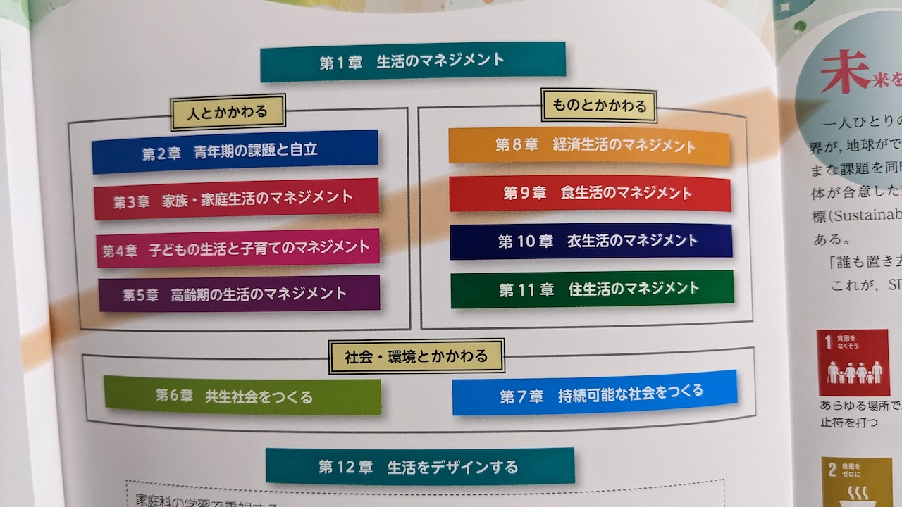

これは私の興味がそこに集中しているからで、本稿では他は無視してきたが、以下に軽く触れておく。

* 教科書の前半はだいたい人の一生の流れに沿って、子供から老人までの生活にまつわるあれこれが書いてある。
  * 正直31歳で子供がいない自分には興味がない。子供が生まれたり、自分が老人になったりしたら興味が出るのかもしれない。そういう意味でも、家庭科の教科書は一生モノかもしれない。
* 食事や服に関する章は、一人暮らしを始めた当時に目を通しておけばよかったとは思っているし、今でもたまに参照すると良さそうである。家庭科教科書を生活マニュアルとして見たときによくできているなと感心するポイントではある。
  * 縫い方やボタンの付け方、洗濯マークの見方など。webで調べれば出るっちゃ出るが、どこかの組織や個人が適当にまとめた情報より、国の検定に通った情報が１箇所で閲覧できるのは良いこと。
  * ただ自分に強い興味がある分野ではないので、今回はパス。
* 住居の章など、自分で家を買うときにならないと自分ごと化しないだろう。
