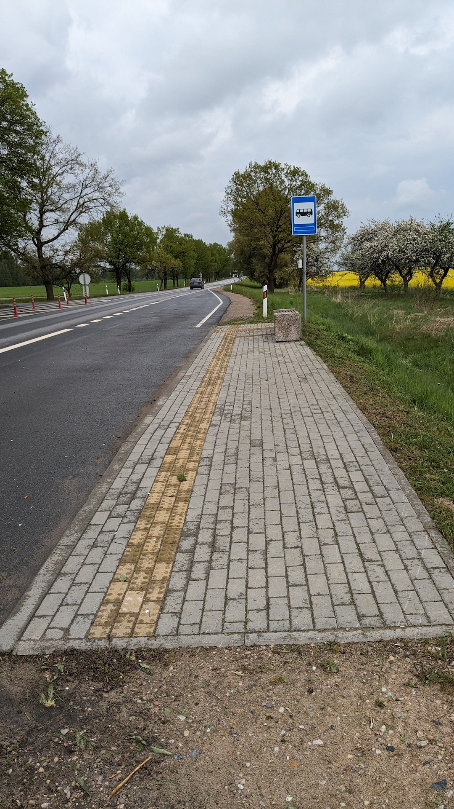

## 予定

リガのホテルをチェックアウト後、ヴィリニュスに移動してチェックインする予定があった。道中なので有名な十字架の丘に寄ることにした。

このルートは検索すると解説が色々出てくる（例: [リガからシャウレイの「十字架の丘」を見てビリニュスへ【ラトビア・リトアニア】, エスニック見ーつけた！](https://search-ethnic.com/riga-vilnius)）。
実際、特に無理もなく回れた。

前日にリガからシャウレイまでのバスだけ予約してあり、残りは現地で時間を見ながら決めることにした。
リガ→シャウレイのバスはこれ: https://www.ollex.lt/en/international-routes/Lithuania-Latvia/buy-a-ticket/Riga-Siauliai

ヴィリニュスのホテルは予約済みかつ予定もあるので、当日中にヴィリニュスに着くのは必須。

## 実際の旅程

| ルート                                     | 出発  | 到着（予定） | 到着（実際） | 料金      | 備考                                                                                                                              |
| ------------------------------------------ | ----- | ------------ | ------------ | --------- | --------------------------------------------------------------------------------------------------------------------------------- |
| Riga bus station → Siauliai bus station    | 09:00 | 11:35        | 11:11        | 20.00 EUR | 予定より早く着いた。シャウレイのバスターミナルでキャリーバッグを預け（1 EUR）、ℹ️で十字架の丘への行き方を聞いてバスチケットを買う |
| Siauliai bus station → Domantai            | 12:15 | ?            | 12:40        | 0.90 EUR  |
| Domantai → Hill of Crosses (徒歩)          | 12:40 | -            | 13:08        | -         |                                                                                                                                   |
| Hill of Crosses 観光                       | 13:08 | -            | 13:30        | 0 EUR     |                                                                                                                                   |
| Hill of Crosses → Domantai (徒歩)          | 13:30 | -            | 13:50        | -         |                                                                                                                                   |
| Domantai → Siauliai bus station            | 14:05 | 14:25        | ?            | 0.90 EUR  | バスで直接チケットを買う。現金のみ。                                                                                              |
| Siauliai 観光                              | ?     | -            | 16:10        | -         | ℹ️でVilniusに行きたいと伝えてチケットを買う。出発時間まで市内を散歩                                                               |
| Siauliai bus station → Vilnius bus station | 16:10 | 19:45        | 19:49        | 18.00 EUR |                                                                                                                                   |

## 反省

- シャウレイから十字架の丘にはタクシーで行けばよかった
  - バス停からの徒歩が2-30分かかる
  - バスの運行間隔がとても長く、スケジュールを組みにくい。自分は14:05か15:45かとなって、先のバスにすると少しあっけない観光になってしまうが、次のバスは1時間半後でそれも長すぎる
- 実際、十字架の丘にはそこそこ人がいたが、バスで来ているのは自分だけだった。
  - Domantaiのバス停と十字架の丘の間を歩いている間、何度もツアーバスに追い抜かれた。
- 何も考えずにバスターミナルのinformation centerに行って十字架の丘への行き方を聞いてしまったのでそのままバスのチケット買ってバスで行く流れになってしまった。
  - 今思えば、帰りだけでも十字架の丘のinformation centerでタクシー呼んでもらうとかできたかもしれない
- 後から調べたらタクシーは2000円とからしい。全然そっちの方がいい。
  - https://www.ironnatoko.com/siauliai/ など

## シャウレイから十字架の丘に行くバスについて

- 都市内の路線バスではなく、長距離路線のバスに近い。車体やチケットのシステムもそんな感じ。
  - その割に道路脇のバス停で乗り降りもするので路線バスぽさもある。
  - 車内に案内板はない。降車を伝えるピンポンもない。
    - 割と初見殺しだった。Google Mapsで現在位置を確認しながら降りる場所を見極めた。乗車時に行き先は伝えてあったので止まってくれるかと思ったら通り過ぎたので、慌てて運転手に「Domantai?」と言いに行ったら止まってくれた。
    - 帰りのバスで他の人を観察してみたところ、降りる時は前の方に歩いていって運転手に伝えていた。これで正解だったぽい…？（自信ない）
  - Google Mapsで経路検索しても当該路線は出てこない
- 少なくとも自分が乗った時は、行きも帰りもちゃんと時間通りに運行していた。
- 以前はインフォメーションで時刻表をもらえたらしいが、今回は帰りの時刻表ある？と聞いたらPCの画面を見せてくれて写真撮ってねという感じだった。

上述の通りバス停をオーバーランしたので、ただの道端で降りた

本来はここで降りたかった

徒歩ルートはこんな感じ

## 十字架の丘

歩いて行くとインフォメーションセンターのマークがあるのでそっちに進んだ。

インフォメーションセンターと物販。

インフォメーションセンターから十字架の丘への道がちゃんと整備されいている。

道を進むと見えてくる。

## まとめ

次があれば絶対タクシーで行こう
