ヴィリニュスには[PyCon LT 2023](https://pycon.lt/2023)に参加するために行った。
カンファレンス前日にディナーイベントがあり、そこで参加者の一人にヴィリニュス観光のおすすめスポットとして猫カフェを教えてもらったので行ってみた。

ちなみに教えてくれた人は日本含め色々な国に行ったことがあり、猫カフェについては「日本にもあるよね」的な感じで話のネタになった。一方でその会話にいたドイツからの参加者は"cat cafe"と言われてピンと来ていなかった。
[Wikipedia](https://en.wikipedia.org/wiki/Cat_caf%C3%A9)によると、猫カフェというコンセプトは日本で花開いたとのこと（発祥は台湾[^1]）。記事中には様々な国が列挙されているので日本限定というわけではないが、この分野（？）における日本の存在感は大きいように見える。そしてドイツには言及がなかった。

[^1]: この記述の出典の一つは[A Brief History of the Cat Café](https://www.mentalfloss.com/article/56592/brief-history-cat-cafe)で、記事中には"The world's first cat cafe, Cat Flower Garden, opened in Taipei, Taiwan in 1998."とあった。一方で[今回行った猫カフェのサイト](https://kaciukavine.lt/)には"Pirmosios tokios kavinės atsidarė 1998 metais Japonijoje ir šiuo metu yra paplitusios po visą pasaulį."（DeepL翻訳「1998年に日本で初めてオープンしたこのカフェは、今や世界中に広がっています。」）とある。どちらが本当かはわからない。

## 場所

[Kačių kavinė: Cat Cafe Vilnius](https://kaciukavine.lt/)

"Cat Cafe Vilnius"でググるとここだけが出るので迷うことはない。上記のWikipediaにもリトアニアの猫カフェとしてここだけ紹介されていた。

TripAdviserのページは[Cat Cafe Kačių Kavinė](https://www.tripadvisor.com/Restaurant_Review-g274951-d7288639-Reviews-Cat_Cafe_KaciU_Kavine-Vilnius_Vilnius_County.html)。好意的なレビューが多い。

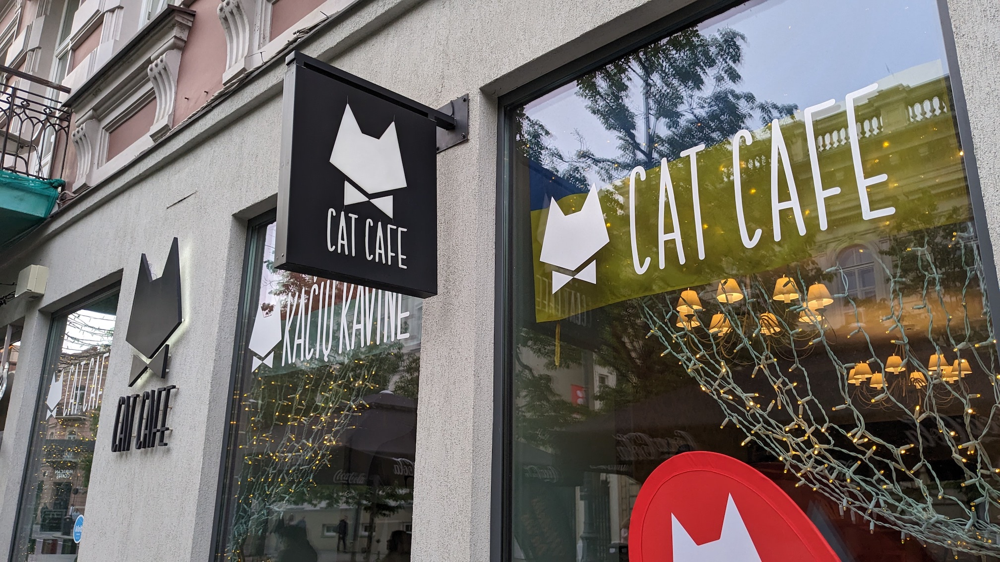

## 訪問
TripAdviserやGoogle Mapsのレビューには予約推奨とあったが、とりあえず予約なしで行ってみた。スケジュール的に余裕があったので、入れなければその場で予約して後日出直そうと思っていた。

行ったのは金曜の夜8時くらい。
結局それほど混んでおらずすんなり入れた。

## 店内
店員さんは全員英語が通じた（そもそも今回のヴィリニュス観光で行った場所は全部英語でOKだった）。
TripAdviserなどのレビューにも同じことが書いてあったので、心配はないと思う。

入り口からすでに猫がくつろいでいたが、触ったりする前にまず店員さんからルールの説明を受け、シューズカバーを履いて手を洗う。

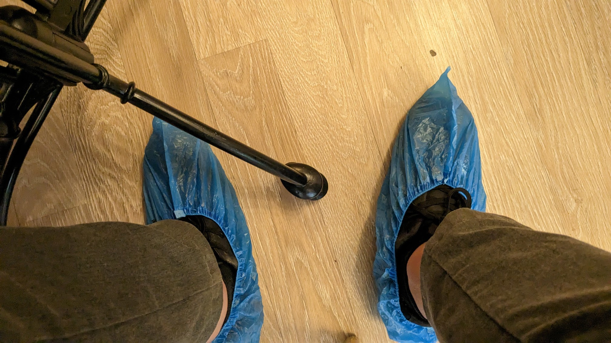

その後席に案内される。

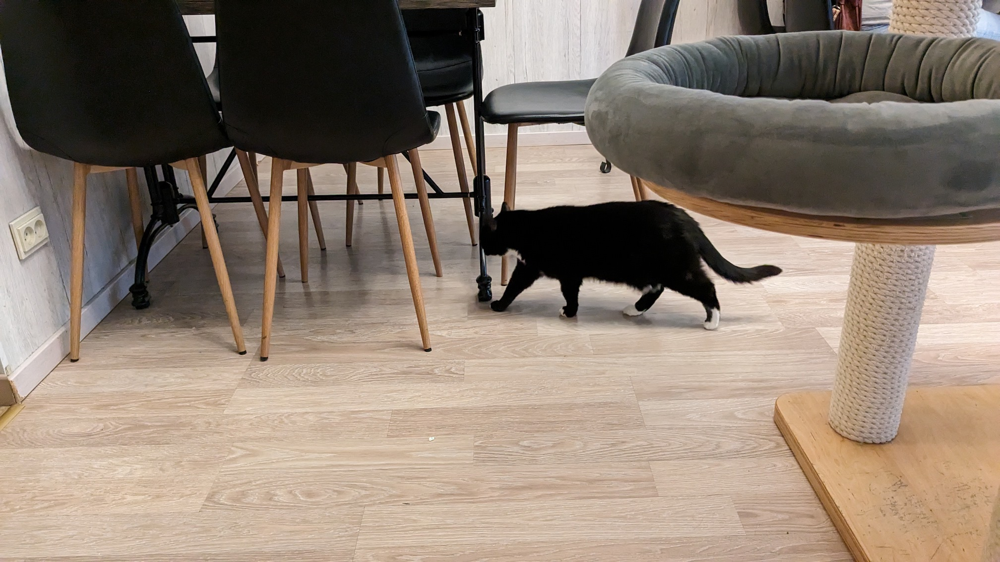

メニューは普通のカフェ・レストランという感じ。サラダ等の前菜からハンバーガーやパスタなどのメイン料理、アルコール類もある。私はツナとトマトのパスタとアペロールスプリッツァーを注文。
この後私の指の匂いを気に入って（？）執拗に嗅いでくる猫がいたのだが、このツナのせいではないかと思っている。
ちなみに食事を猫に与えるのは禁止。

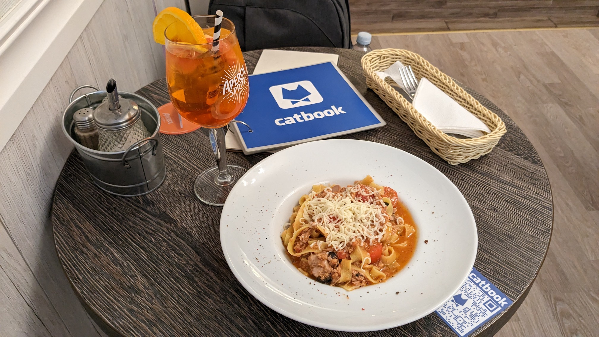

私は日本の猫カフェには１ヶ所だけ行ったことがあり、そこは猫メインで飲食はおまけ程度のワンドリンクみたいな感じだった。それが好きになれず結局他の猫カフェにも行かず終いだったのだが、ここは完全に飲食だけでサービスとして成立しているカフェなのがとても良かった。それに加えて猫もいる。

カフェフロアの中央にキャットタワー（？）があってこの時は猫が寝ていた。寝ている猫に触ったりするのは禁止。
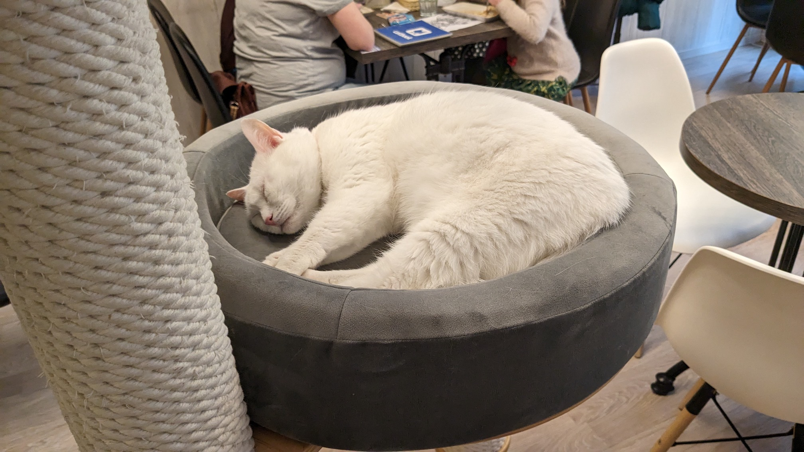
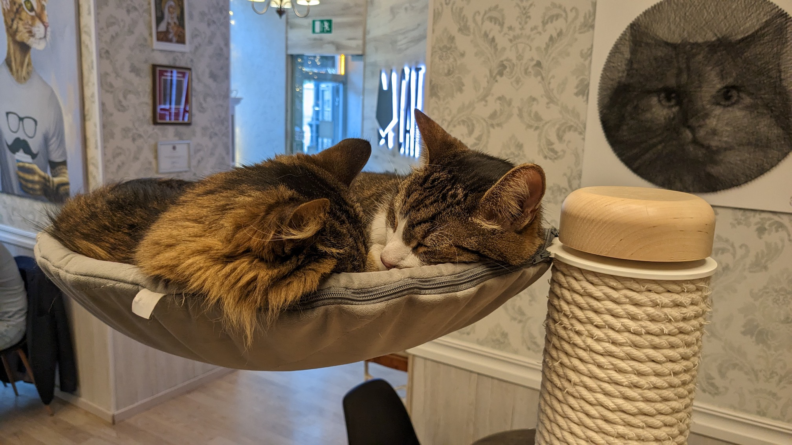

カフェフロアは２部屋が段差で繋がっている感じ。猫は奥の部屋と手前の部屋を歩き回っている。
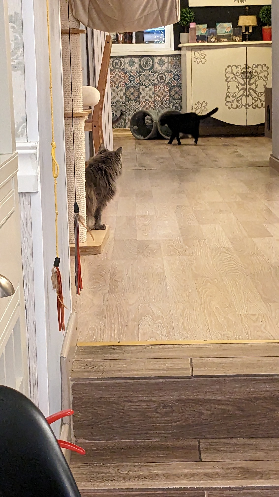

ミードがリトアニア名物らしいので食後にそれも注文。これで100ml。
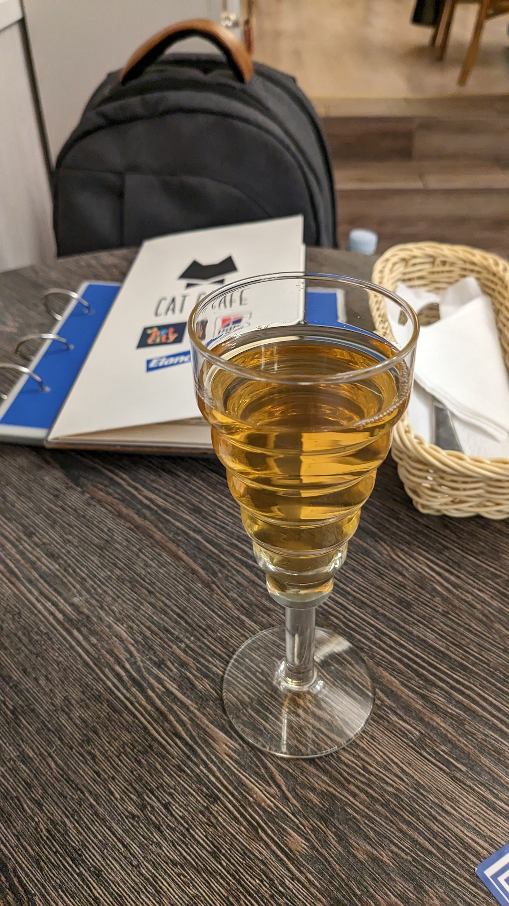

この猫が隣の空いたテーブルの椅子で休み始めたので触りに行ったら成功した。
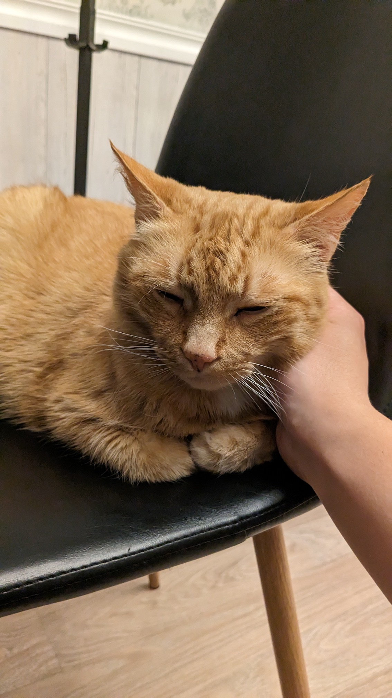

この猫が歩いてきて目の前で止まったので、膝の上を手で叩いて「乗っていいよ」と合図したら乗ってくれた。これは店員さんがこの猫に対してやっていたテクニックを真似した。
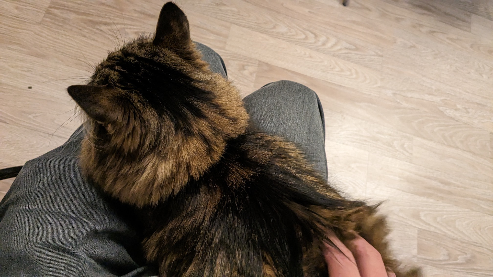
しばらくしたら行ってしまった。
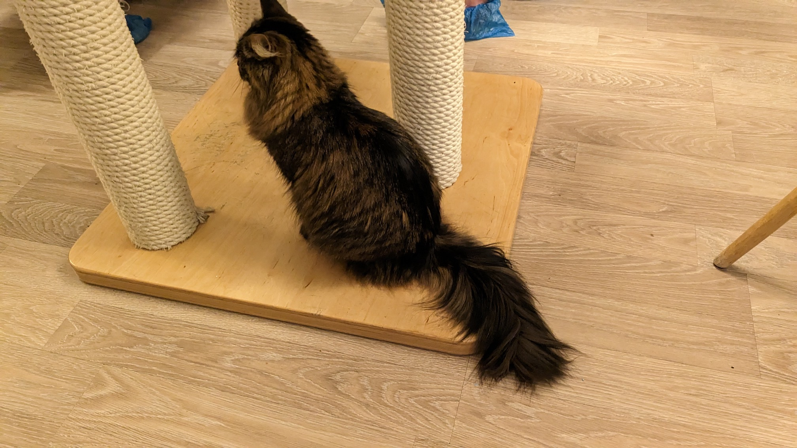

帰り際の一枚。
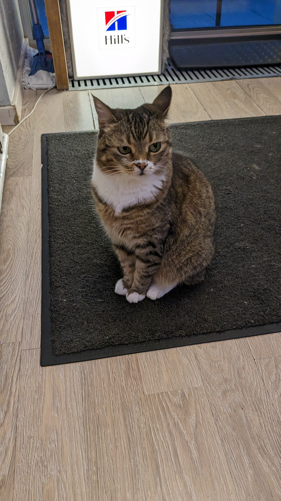

## 感想
とてもよかった。

このカフェには15匹も猫がいるらしい。全員に会えたわけではないし、仮に会えても触れ合える保証はないが、単純に密度が高いと楽しい。せっかく猫カフェに来ているので。しかも今回は運良く2匹と仲良くできた（と思う）。

食事も良かった。特に高いということもなく、この街の他のカフェ・レストランと同程度の価格で美味しい食事とお酒を楽しめた。上にも書いたが、純粋にカフェとして成立している。
その上で特に追加のチャージもなく猫がいるという付加価値があるので単純にお得感が強い。
