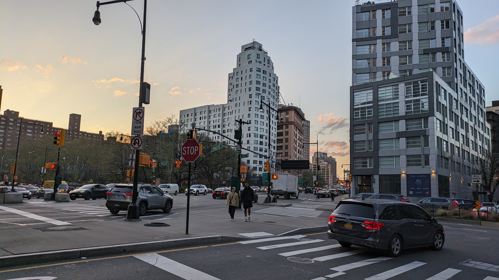
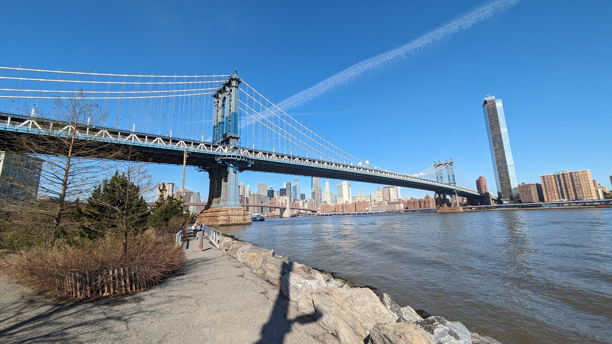
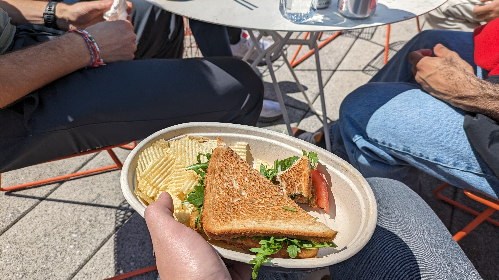
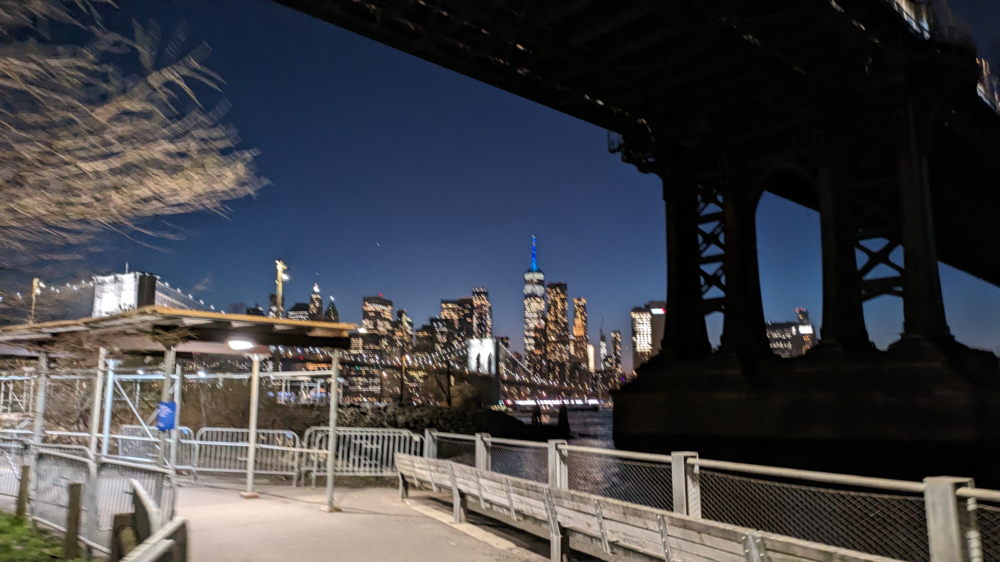
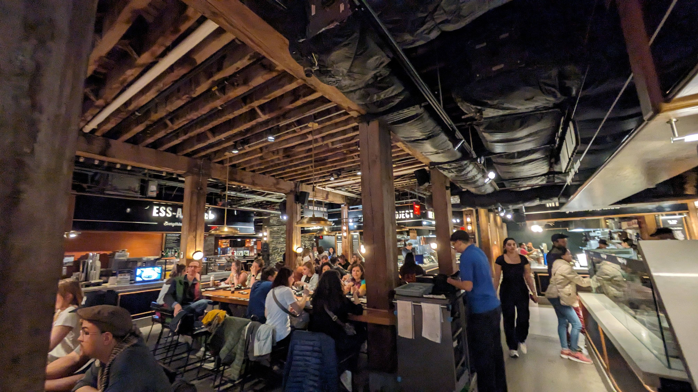
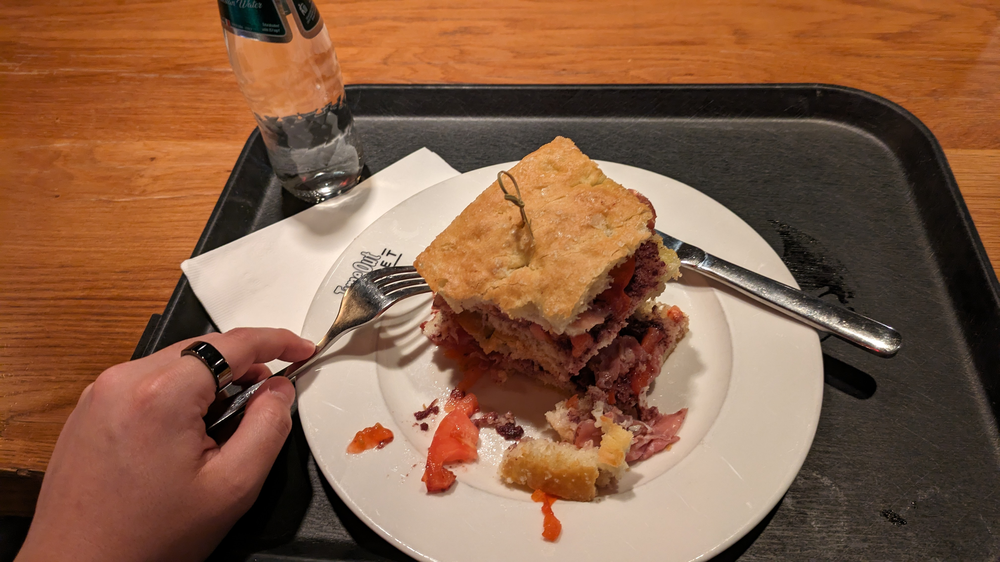

今はHugging Faceの[Gradio](https://www.gradio.app/)チームで働いている（[経緯](../20231229-personal-review-2023/)）。普段はフルリモートだが、1週間一緒のオフィスで働こうという企画があり、オフィスの一つがあるニューヨークに集まることになった。

## チケット

Google Flightsで前後の日程を検索し良さそうなフライトを眺めるということはチームに出席連絡をした直後からやっていたが、優柔不断な性格のせいで実際にチケットを買ったのは出発まで2週間を切ってからだった。

出発・到着時刻がちょうど良い（なるべく遅く出発したい・交通機関が動いていて活気のある時間に着きたい）直行便でお値ごろな便をクエリしたらJALになった。
普段ANAマイルを貯めているのでANA便にしてアップグレードしようかと思ったがいい便がなくて諦めた。調べてみるとマイルの使い勝手なんかもJALの方がいいみたい。乗り換えようかと思う。

運よくエコノミー料金でプレミアムエコノミーのチケットが取れた。Google Flightsでエコノミー料金で検索していて、そのままJALのサイトに移動して買おうとしたらそこでプレミアムエコノミーになっていることに気づいた。急いで買った。

* 往路: JL4 HND-JFK 18:30 18:25
* 復路: JL3 JFK-HND 01:30 04:45

## 往路
フライトは13時間程度。
１枚だけラッキーで取れたプレエコなので席は中央だったが、プレエコなので快適だった。
着いてから寝るため極力起きて過ごすよう頑張った。

ワイン各種がおいしかった。JALに乗り換える理由がまた一つ。

まだ明るい夕方に到着。
公共交通機関で行こうかとも思ったが疲れていたのでUberにした。今思えばLyftの方が安かったかもしれない。

## ブルックリン滞在

オフィスがブルックリンにあるのでその辺りのホテルに宿泊。シティホテルのキングベッドの部屋で１泊36,000円くらい。高いが、物価高・円安のニュースでセンセーショナルに報じられるほど死ぬほど高いわけでもない…かな。

着いた日は面倒だったので高いのを承知でホテルのバーで食事した。ハンバーガーセット24USD、タップビール9USD。これも高いが、それでもまあこんなもんかなぁという感じ。ハンバーガー大きいし。

オフィスはブルックリンブリッジの袂あたりにあり、川辺を散歩できていい感じ。

近くのにおいしいカフェがあった→[Devoción](https://maps.app.goo.gl/R8r5V9V968y5jVE87)

滞在期間中は基本的にオフィスでチームと一緒に仕事をしていたので観光という感じではなかった。
[普段より捗ったと思う。](https://github.com/gradio-app/gradio/pulls?q=is:pr+author:whitphx)

ランチはこの時集まったチームメンバーやオフィスにいる他のチームのメンバーと一緒に行ったりした。
[パリオフィスに行った時](../20230619-pycon-europe-round-trip/)もそうだったが、テイクアウトしてオフィスや屋上なんかで食べる。日本みたいに近くの飲食店にみんなでふらっと入って手頃な値段で食べて1時間で出てくるというのはあまりないのかな？
1週間を通してランチを買った場所↓
* [Bread & Spread](https://maps.app.goo.gl/CkDktZfvMNWvd8Zs9)
    
    * おいしい
* [Lucky Rabbit Noodles](https://maps.app.goo.gl/1RwjPtKZKSJ8Vby28)
    * アジアンヌードル。焼きそばではないけどなんかそんな感じ。まあまあ。
* [La Bagel Delight at Dumbo](https://maps.app.goo.gl/XeiSL2yN7F7ekCyk9)
    * ベーグル。いろいろ選んでカスタマイズする。おいしい。
* [Bridge Fresh](https://maps.app.goo.gl/WmeLG7JybNfUykhE8)内のバーガーショップ
    * ここだけ一人で適当に入った。微妙。現地の人のおすすめは聞いた方がいい。

1日目の夜はチームメンバーの一人に[タイムアウトマーケット](https://maps.app.goo.gl/CWBcjHFEigVahcBY9)に連れて行ってもらった。[リスボンにも](../20231230-travel-portugal-spain/)タイムアウトマーケットはあったが、こういうフードコートみたいなスタイルの場所をそう呼ぶのかな。

10年前に一度旅行でニューヨークに来たことがある。
その時はマンハッタンのホステルに数泊してマンハッタンばかり見ていた。

## 最終日: マンハッタン巡り

## 帰路
