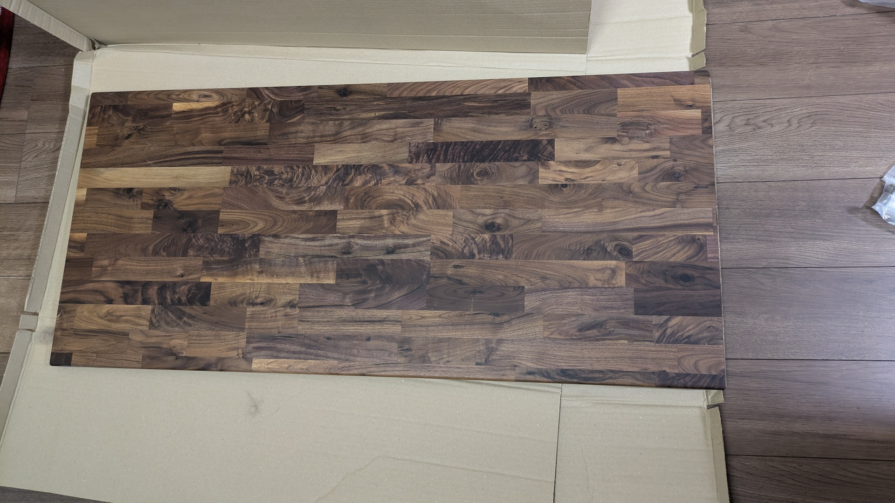
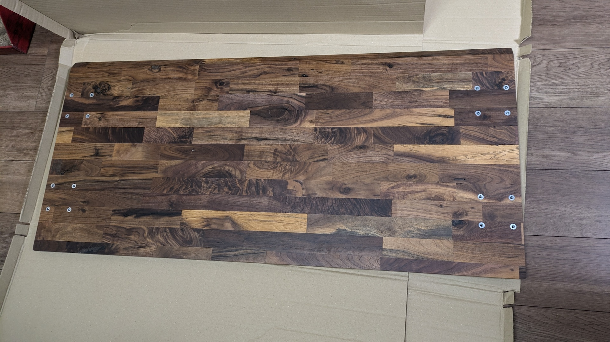

引っ越して間取りが変わったのでデスクを新調することにした。
既製品でぴったりのものが見つからなかったので、自作することにした。

Amazonで脚を買い、天板は自分好みのものを[マルトクショップ](https://shop.woodworks-marutoku.com/)でオーダーして組み立てた。特別な工具も使わず、届いたものをネジで組み立てるだけで完成した。

## 要件
### MUST
* 天板の幅は120cm。家具のレイアウト的にこれが限界。
* 脚部分の奥行きは45cm程度、天板の奥行きは55cm。背の低い引き出し家具の隣に置くので、その引き出しスペースを確保するため脚の幅は狭め。一方で天板はそこから張り出させて作業スペースを広くしたい。検討の結果この数値に。
* 高さは70cm前後。[WORKAHOLIC](https://www.iamworkaholic.jp/)でPCチェアを選んだ時に、その時のテーブルの高さを測った。
    * [自動計算ツール](https://www.bauhutte.jp/bauhutte-life/tip2/)によると、キーボード作業で自分にベストな高さは71cm。
* モニターアームをクランプで設置するので、そのための強度が必要。

### SHOULD
* テーブルは壁際設置ではなくアイランド形式で置くので、せっかくなら奥側に補強パーツなどを付けずに完全に吹き抜けにしたい。足も伸ばせる。
* 足は鉄製にしてマグネット家具を付けられるようにする。
* 手前側の辺は下側に向けて傾斜をつける。なんとなく足元にスペースを感じる気がする。
* かっこいい木材。

## 自作の方針

いろいろ探したが、上記を満たすベストな製品が見つからなかった
（繋ぎで[CLAS](https://clas.style/)で借りた[ダンテ デスク](https://clas.style/469)は結構良かったが）。

自分は特にDIYをしたいわけではなく、なるべく楽に希望のデスクが欲しいだけだったが、自作デスクについて調べてみた。
ほとんどの人が[マルトクショップ](https://shop.woodworks-marutoku.com/)で天板を注文して作っており、このショップにはほぼ全ての作業を任せられることもわかった。
指定サイズの天板だけ発注して磨き・塗装・ネジ穴開けなどは自分でやっている人もいて（[この記事](https://note.com/ash/n/n586866541022)や[この記事](https://note.com/arajin2000/n/ncb6e3d53db6c)）、最初はこれらの記事を読んで尻込みしてしまったが、
マルトクには塗装や鬼目ナットの取り付けまでやってくれるオプションもあるので、それを使えば脚をネジで取り付けるだけでデスクが完成する。
ここまでやってくれるならただのカスタマイズ組み立て家具なので、この方向で行くことにした。

ちなみに鬼目ナットとは、木材に直にネジを打ち込むのを避け、ネジをつけるための金具を木材側に埋め込むためのもの→[鬼目ナットについて](https://shop.woodworks-marutoku.com/mokumoku_index/kakou_other/#a4)

マルトクのこの記事：[ドライバー1本で組立完了！加工済テーブル天板を注文する](https://shop.woodworks-marutoku.com/mokumoku_index/tabletop_order/)に、マルトクで天板を注文して自作デスクを作る一通りの流れが乗っているので、これの通りに進めていく。

## 脚選び

マルトクはまさに自分のような人向けに天板とセットで[鉄脚も売っている](https://shop.woodworks-marutoku.com/lp/leg/)。これらの鉄脚はマルトク側で仕様を把握しているので、これを買うとネジ穴の位置・サイズ指定で楽できたり先方でも仕様の間違いがないかチェックをしてくれたりという利点があるようだった。

しかし自分の場合は「脚の間隔は45cm程度」という条件にあう製品がここで見つからなかったので別で買うことにした。

[【DIY】木材の天板で仕事用デスクを自作してみた (note)](https://note.com/ash/n/n586866541022)で紹介されていた[エイ・アイ・エス(AIS) テーブルキッツ脚 奥行45cm用ハイタイプ スチール・金属 長方形 ブラック TBK-4366ST BK](https://www.amazon.co.jp/dp/B01CJF6Q5Q)にした。

注文時点で￥7,829。

## 木材選び

具体的なサイズや各種仕様を決めてオーダーする前に、使う木材を選ぶ必要がある。
マルトクの[木材サンプル](https://shop.woodworks-marutoku.com/cart/multi_order_sample.php)をいくつか発注して実物を見てみることにした。
この木材サンプルにサンプル塗装をしてもらうこともできる。自分は各木材サンプルの両面にそれぞれウレタン塗料クリアーと自然塗料クリアーを塗ってもらった。

サンプルを見て検討した結果、自分は[ウォールナット(節・白太有り)　集成材](https://shop.woodworks-marutoku.com/cart/multi_order.php?g_goodtype=2&g_good=2969)＋ウレタンクリアー塗装にした。
ちなみにこの木材はサンプルとしては注文できなかったので、実物を見ずに決めることになった。
注文したサンプルに通常のウォールナット集成材は含まれており、その色味と質感は気に入ったものの、節・白太有りのサンプルはそもそも注文できなかった。
一方でアカシアの節・白太有りのサンプルも注文していて、そのコントラストの面白さが気に入った。
これらを参考にして、ウォールナットの節・白太有りが良いのではないかと判断した。

## 設計

マルトクのオーダーフォームを埋めるための情報を決めていく。

### 使用方向
選んだ[（ウォールナット(節・白太有り)　集成材）](https://shop.woodworks-marutoku.com/cart/multi_order.php?g_goodtype=2&g_good=2969)は三方向使用のみ対応なので自動的に決定。
裏側に節などが入るが自分のユースケースでは問題なし。

### サイズ
* 厚さ：25mm
    * [この記事](https://shop.woodworks-marutoku.com/mokumoku_index/%E3%83%86%E3%83%BC%E3%83%96%E3%83%AB%E3%82%92%E4%BD%9C%E3%82%8B%E3%80%80%E3%81%9D%E3%81%AE%EF%BC%92%E3%80%90%E5%A4%A9%E6%9D%BF%E3%81%AE%E5%8E%9A%E3%81%95%E3%82%92%E6%B1%BA%E3%82%81%E3%82%8B%E3%80%91/)などを参考にした。今回の木材の場合、25, 36, 40mmから選ぶ。それほど広くない天板なので、25mmでも強度的に問題ないだろうと思いこれにした。
* 幅：550mm
* 長さ：1200mm

### 面取り
各辺の[面取り加工の種類](https://shop.woodworks-marutoku.com/shared/images/detail/POP3.html)を選ぶ。
* 面[A]:糸面 ＋ 磨き
* 面[B]:糸面 ＋ 磨き
* 面[C]:Ｃ面（2:裏面）＋ 磨き
* 面[D]:糸面 ＋ 磨き

デスクとして使う時に手前側に来る辺の面取りを「Ｃ面（2:裏面）」とした。

Ｃ面にした辺と接している辺は糸面しか選べないので自動的に決定。
また奥側の辺は特にこだわる必要がない上、Rが大きいとむしろクランピングの邪魔になるので、そちらも糸面にした。

### コーナーR加工
全て5mmとした。

### 塗装
レタンクリアー 両面（ツヤ全消し）

### オプション：鬼目ナット取り付け
買った脚の仕様に合わせて、M6を16箇所。

### その他のオプション
他にも色々なオプションを指定できるが、自分は選ばなかった。
* 反り止めの取り付け：[この記事](https://shop.woodworks-marutoku.com/mokumoku_index/prevention/)や[この記事](https://shop.woodworks-marutoku.com/mokumoku_index/%e3%83%aa%e3%83%9a%e3%82%a24%e3%80%80-%e3%82%bd%e3%83%aa%e3%81%a8%e3%81%ae%e4%bb%98%e5%90%88%e3%81%84%e6%96%b9%e3%80%90%e3%82%bd%e3%83%aa%e3%82%92%e7%a7%91%e5%ad%a6%e3%81%99%e3%82%8b%ef%bc%9f%e3%80%91/)が参考になった。自分の場合は[買った鉄脚](https://note.com/ash/n/n586866541022)が反り止めを兼ねる形のため不要と判断。
* 穴あけ：例えば[この記事](https://www.orangedesign-company.com/blog/diary/551/)では天板に穴を開けて電源を埋め込んでいたが、自分の場合はモニターアームをクランプで付けるため、強度を下げないために穴は開けないことにした。必要があれば[クランプ式の電源](https://www.amazon.co.jp/gp/product/B074JP6FHQ)を付ければ良い。
  また穴あけ加工は切り欠きとしても使えるが、切り欠きもクランピングの邪魔になりうるし、自分はデスクを壁付けせずアイランド形式で置くので切り欠きでコード類を逃す必要もない。
  * 後から気づいたが、モニタアームはクランプで付けるより、穴あけオプションで天板に穴を開けてグロメット式で取り付けた方が強度的には良かったのかもしれない。

### 図面
注文をカートに入れた後、設計図を画像としてアップロードできる。
自分の場合は鬼目ナットの加工位置を示すために、設計図を提出した。マルトクの[この記事](https://shop.woodworks-marutoku.com/mokumoku_index/insert_nut/)に書いてあるとおり、文字で指定するより図面を提出した方が伝わりやすいしミスも減らせる。
> 
> 簡単・手描きで良いので図面があるととっても助かります

自分が提出した図面は以下。
コピー用紙に定規と鉛筆・ボールペンで書いた。
CADを使ったりする必要はないし、工学的に（？）正式な図面の書き方も知らないが、これで問題なかった。

鬼目ナットの位置は、先に買ってあった鉄脚の穴の位置を実際に定規で測った結果を使って決めた。

## 発注・組み立て

上記の通り発注。
34,540円（税込）だった。普通のオーダーメイドブランドのデスクより全然安いと思う。

届いた天板がこちら。

ちゃんと鬼目ナット加工がされている。

鉄脚のネジ穴ともぴったり。

ネジを締めるだけで完成。ネジやワッシャーは鉄脚に付属のものを説明書通りに使った。

完成。

注文通りの面取り。

設置。

TODO: 設置した状況の写真
